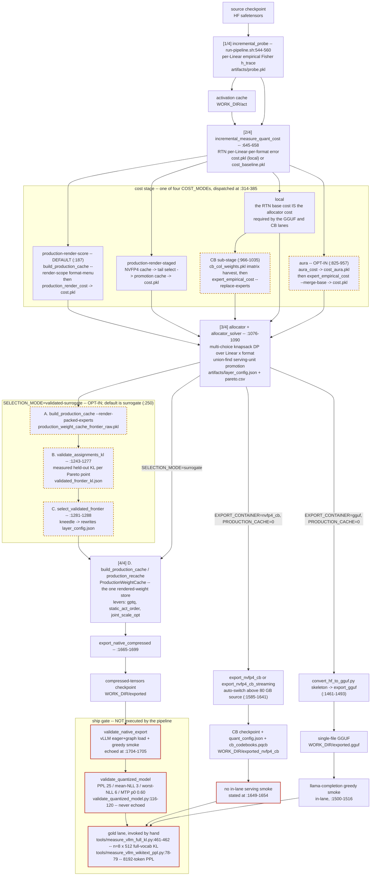
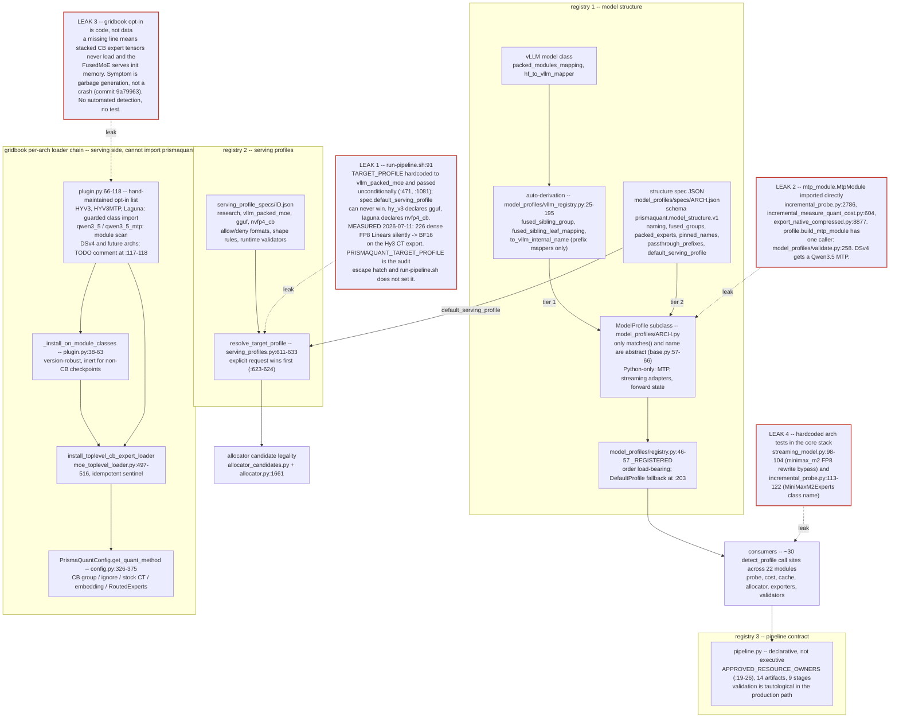
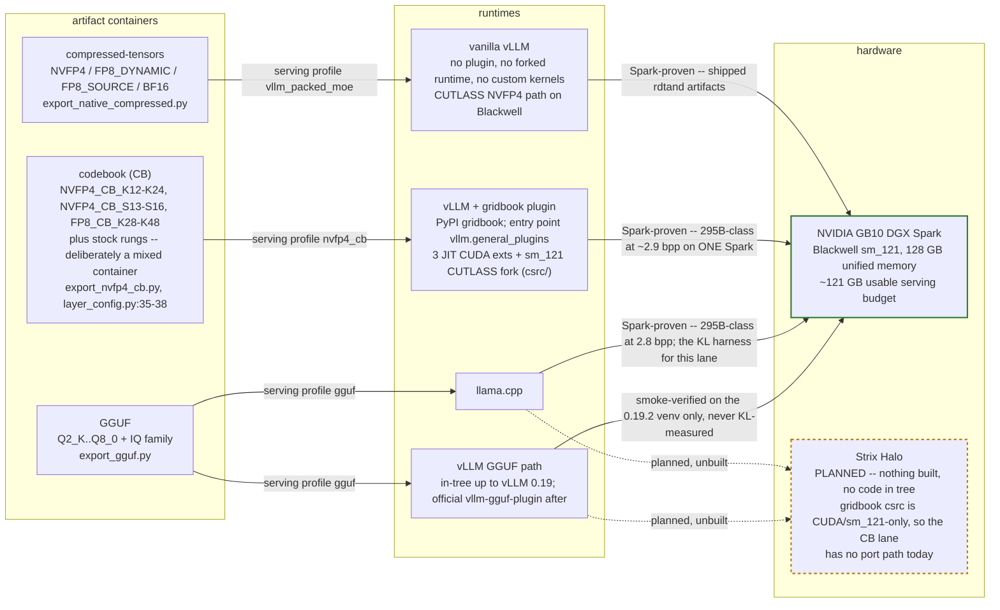

# PrismaQuant Architecture

As of: 2026-07-30 · branch `claude/docs-consolidation` · verified against merge `8f14400`
(= NVFP4-CB lane + `origin/main`'s 54-commit allocator/release stack) plus the same-day
cleanup/fix batch committed with this document

**Prime directive:** the code is the authority. Where this document and the tree disagree, the
document is wrong — fix it, or record the divergence in §12; never propagate it.

---

## Contents

[0 Maintenance contract](#0-maintenance-contract) ·
[1 What PrismaQuant is](#1-what-prismaquant-is) ·
[2 Methodological spine](#2-methodological-spine) ·
[3 The quantization pipeline](#3-the-quantization-pipeline) ·
[4 Cost models & allocation](#4-cost-models--allocation) ·
[5 Formats & render](#5-formats--render) ·
[6 Export & serving invariants](#6-export--serving-invariants) ·
[7 Validation & ship gates](#7-validation--ship-gates) ·
[8 Model support: the plugin architecture](#8-model-support-the-plugin-architecture) ·
[9 Serving lanes](#9-serving-lanes) ·
[10 Hardware & environment](#10-hardware--environment) ·
[11 History](#11-history--what-was-tried-and-rejected) ·
[12 Known gaps and debt register](#12-known-gaps-and-debt-register)

## 0. Maintenance contract

This file is the master document. `docs/README.md` is the index and carries a status tag
(CURRENT / HISTORICAL / ARCHIVED) per doc; everything else is a rule set this file points at,
a lane record, or history.

**The rule.** A commit that changes any of the following must update this file in the same
commit: (1) a `prismaquant/run-pipeline.sh` default, gate, or stage order (§3); (2) the format
menu, a scale rule, or a render lever (§5); (3) an export codec, a `config_groups` emission
rule, or a serving invariant (§6); (4) a ship-gate threshold or what the pipeline runs versus
echoes (§7); (5) the plugin contract — profile accessors, registry order, serving-profile
schema, gridbook per-arch wiring (§8); (6) a serving-lane default or a promoted/reverted kernel
lever (§9). If topology changed, the affected mermaid diagram changes with it. The provenance
block at the top must be re-stamped (date, commit, branch) on every substantive edit.

**Corollaries.** Handovers (`docs/handovers/`, gitignored) and dated results (`docs/results/`,
`docs/lanes/*/`) are append-only history: they record what was true on a date and never
substitute for updating this file. Every normative claim here carries a `file:line` or a commit
hash — a claim without one is a lead, not a fact. Staleness discovered in this document is a
bug: fix it, or if the fix is larger than the edit, add it to §12 with a severity. Do not
silently leave a wrong line here for the next reader.

## 1. What PrismaQuant is

Mixed-precision LLM quantization that chooses a serving format **per Linear**, selects the
assignment on **real end-to-end KL-vs-BF16**, and ships the result as an artifact a stock or
plugin-extended vLLM serves. No forked runtime on the native lane. Allocation is a
multiple-choice knapsack over a per-(Linear, format) cost (§4); the winning candidate is decided
by measurement, not by the cost model (§2).

### 1.1 The three artifact containers

| Lane | Container | Runtime | Formats | Status |
|---|---|---|---|---|
| Native | `compressed-tensors` | vanilla vLLM, Blackwell CUTLASS | NVFP4, FP8_DYNAMIC/E4M3, FP8_SOURCE, BF16 | production default |
| CB ("gridbook") | `nvfp4_cb` codebook checkpoint | vLLM + `gridbook` plugin (`plugins/gridbook`, PyPI `gridbook`, custom CUDA/CUTLASS) | FP4-CB / FP8-CB rungs plus the native menu | production for 4 wired archs; DSv4 unwired (`plugins/gridbook/gridbook/plugin.py:117-118`) |
| GGUF | single `.gguf` | llama.cpp; vLLM via `vllm-gguf-plugin` | Q2_K…Q8_0 k-quants + IQ family + BF16 | enabled end-to-end; the only 2–3 bpw path |

Lane detail, defaults and proven results: §9. Export codecs: §6. Pipeline defaults: §3.3.

### 1.2 Shipped artifact family

bpp is over **quantizable** parameters only (excludes `lm_head`, MTP/visual sidecars, pinned
Linears) and labels are **not** comparable across accounting eras (§12). conf-KL =
confident-position KL-vs-BF16; ALL-KL = all positions. Comparative lane deltas belong to §9;
the numbers below are each artifact's own readout.

| Artifact | Lane | bpp | Quality readout | Provenance |
|---|---|---|---|---|
| Qwen3.6-27B `prismaquant-cb-5.5bit-vllm` | CB | 5.501 | ALL-KL **0.0134** / conf-KL 0.0113; PPL 9.166 vs BF16 9.123 | `docs/lanes/nvfp4-cb/prod_27b_results.md` |
| Qwen3.6-27B `PrismaAURA-5.5bit` | native | 5.5 | ALL-KL 0.0321 / conf-KL 0.0241; TEB 91 (BF16 86) | same A/B table; TEB from memory, unverified vs code |
| Qwen3.6-27B PrismaSCOUT 5.31 (DOI `10.57967/hf/8656`) | native | 5.31 (≈4.76 under current accounting) | held-out KL 0.0151, 20.17 GB | superseded by the two rows above |
| Ornith-1.0-35B (CB) | CB | 4.758 | conf-KL **0.01706** / ALL-KL 0.0278; PPL 9.542 (+1.1%) | `docs/lanes/nvfp4-cb/prod_35b_results.md` |
| Ornith-1.0-35B PrismaAURA | native | 4.748 | conf-KL 0.03625 re-measured; the older **0.0143** figure is a different protocol and is *not* comparable | `prod_35b_results.md` |
| Hy3-295B-A21B `prismaquant-cb-2.9bit-vllm` | CB | 2.902 | no quality claim possible (no 295B BF16 teacher on one box); TEB 87/100; serves on one Spark | `docs/lanes/nvfp4-cb/prod_hy3_results.md` |
| Hy3-295B-A21B `PrismaQuant-2.8bit-gguf-vllm` | GGUF | 2.799 (103.686 GB) | TEB 87/100 (IQ) vs 86 (k-quant) | `docs/lanes/gguf.md` |
| Hy3-295B-A21B `PrismaQuant-5.3bit-2xSpark-vllm` | GGUF | 5.3 (190 GB) | two-Spark target | memory, unverified vs code |
| Laguna-S-2.1 117B | CB | 6.0 (84 GB) | no BF16 teacher at 117B; serves 256k ctx | memory `laguna_s21_lane`, unverified vs code |
| Gemma4-31B-IT | native | 6.0 | −24% conf-KL vs the shipped 5.5, +5.9 pp top-1 | memory, unverified vs code |
| LFM2.5-8B-A1B | native | ~6.58 (labelled 6.5) | ToolEvalBench = BF16 parity | memory, unverified vs code |
| Qwen3.5-122B-A10B · Mistral-Medium-3.5-128B · Qwen3.6-35B-A3B | native | 4.75 | — (the 35B-A3B predates 4 allocator/export fixes; do not re-export without an orthogonal reason) | memory, unverified vs code |
| MiniMax-M2.7 | native | 3.2 | — | memory, unverified vs code |

The two CB rows carry the load-bearing result: at matched body bytes, codebook formats buy
materially more quality. The magnitudes, and the speed side of the trade, are §9.2.

Author: Robert Tand, independent researcher; public attribution uses
`robert.tand@icloud.com`. Paper: `paper/main.tex` (AURA spine; the PrismaSCOUT spine was
retired 2026-06-05 and archived at `paper/archive/prismascout_paper_2026-06-05.tex`).

## 2. Methodological spine

### 2.1 Two axes

- **Local** — *given a fixed format, how do you round this Linear best?* Well studied: GPTQ,
  AutoRound, rotations, scale rules. The render toolkit; it runs *under* whatever format is
  chosen (§5).
- **Global** — *how many bits does each Linear get, and in which hardware format?* Allocation,
  and the contribution (§4). Sensitivity is wildly unequal across a transformer's Linears, so a
  heterogeneous assignment extracts quality no single-format method structurally can.

### 2.2 Surrogates generate, real KL selects

The governing sentence: *an allocator does not need a perfect cost model if every candidate it
proposes can be cheaply re-scored end-to-end on a held-out split.* Cross-layer interaction
therefore stops being a quantity you must **model** and becomes one you **observe**.

The modelling branch of the literature (CLADO's pairwise IQP, HAWQ-V3's second-order ILP,
CoopQ's Shapley allocator) is not reproduced here: measured pairwise interaction is noise at
the bit-widths that ship (3/1180 pairs significant; pair-term ρ = −0.10), and the apparent
non-additivity is largely a bf16 KL-differencing floor — in fp32 the per-Linear unary KLs are
near-additive (`paper/main.tex` §additivity; §11).

The retired three-level cascade (L1 Fisher → L2 perturbed-X fixed point → L3 propagated
end-KL) is history, not architecture: L2 is **not** a live cost mode and L3 is opt-in and off
by default. Status and citations: §4.4.

### 2.3 Metric authority

Highest first. A claim is worth exactly the rung it was measured on.

| # | Metric | Contract | Where |
|---|---|---|---|
| 1 | Exact full-vocab vLLM KL-vs-BF16 on the served artifact, matched bpp | n=8 × seqlen=512 | `tools/measure_vllm_full_kl.py:461-462` — invoked **manually**, never by the pipeline |
| 2 | Direct WikiText PPL on the served artifact | 8192 tokens, seqlen 512 | `tools/measure_vllm_wikitext_ppl.py:78-79` — manual |
| 3 | Mean NLL alongside PPL; KL-vs-BF16 (`/home/rob/dq-runs/kl_tool.py`) for IT/BOS-sensitive models where raw PPL is meaningless | — | §7.5 |
| 4 | Downstream suite on materialized artifacts: GSM8K, IFEval, MMLU, **ToolEvalBench** (`--no-think --hardmode --parallel 1`) | — | tool-use fidelity is the deep reason KL matters: a small probability shift at a decision point flips a tool call |
| 5 | Cheap last-token "hook KL" screens | — | **triage only**; never a selection or promotion metric |

Rung 2 can veto a rung-1 win — a lower *mean* KL can hide a heavier tail. A candidate that
improves calibration KL but regresses held-out PPL/NLL or a downstream task stays
research-only unless Robert explicitly accepts the trade. (The selector has no tail term
today; §12 D1.)

**Held-out discipline.** The selection split must be disjoint from the text that generated any
cost — an audit found "validation" KL had been in-sample; the house rule and the
token-disjoint construction are documented at `validate_assignments_kl.py:513,581`. Small-scale
levers are validated on Qwen3-0.6B *and* 4B with `--calib-repeats ≥ 4`; single-seed n=8/T=512
is dangerously noisy (+10% can flip to −5.2% across repeats).

**Reproducibility is a gate.** Git commit, calibration hash, assignment hash and cache
hit/miss/RTN-fallback counts are baked into output JSON; an irreproducible number is
quarantined, not trusted. KL is bit-identical within a docker session and drifts across them —
mechanism, magnitude and the resulting A/B rule are §7.4.

### 2.4 Promotion ladder

| Stage | Bar |
|---|---|
| Research | opt-in, documented, excluded from defaults |
| Candidate | small-model GPU + vLLM smokes, plus a measurement plan on a real target |
| Production recipe | wins or preserves KL/bpp/runtime on the target stack; serving suite green; tests |
| Default-on | cleared on the target **and** one more representative model/shape |

Regression or inconclusive → demote back to Research. The numeric ship gate that guards
materialization is separate, automated and thresholded (§7.2).

### 2.5 Honest accounting

Retraction is routine and is itself a deliverable. The grouped-KL surrogate's "−3.52% PPL win"
was a local/HF screen that **inverted** on the vLLM A/B; the "17 promotions / 0.0056 KL" polish
headline and the "4× lower KL" framing were withdrawn the moment the comparisons were found
non-rigorous; the staged-render last-token-KL win regressed direct PPL; `current_only`
extrapolation won its hook screen and lost full-vocab KL; the damp sweep's "+137.5% if
disabled" was a hook screen that inverted on the gold lane. Hence the rule: **never sell a
screen as a result.** Expect most pipeline "improvements" to be <5% deltas — the cost surrogate
is itself mis-ranked against PPL at the margin (5.5 bpp beats 6.0 bpp on Qwen3-4B WikiText
PPL). Negative results are recorded with the durable lesson (§11); the paper publishes the
graveyard.

## 3. The quantization pipeline

The orchestrator is `prismaquant/run-pipeline.sh` — **not** the repo root; several older docs
imply a root-level copy and there is none. One bash script, four numbered phases (probe → cost
→ allocate → cache+export), each phase file-artifact-coupled and skip-if-exists.
`prismaquant/pipeline.py` is a *declarative* spec layer invoked once at the top; it executes
nothing (§3.6).

**DIAGRAM-1 — Pipeline dataflow:** source checkpoint to three artifact containers, with the
four `COST_MODE`s, the opt-in validated-frontier loop, and the manual (echoed-only) ship gate.



### 3.1 Pre-flight gates

In order, all failing `exit 2`: required `MODEL_PATH`/`WORK_DIR` (`43-44`); GGUF lane
consistency (`97-110`); CB lane consistency (`119-132`); GPU-or-bust — both `DEVICE` and
`EXPORT_DEVICE` must match `cuda*` and an inline `python3` asserts `torch.cuda.is_available()`
(`134-145`); the archived-lever gates of §3.5 (`233-248`, `337-340`, `387-406`); `COST_MODE`
dispatch, unknown mode rejected (`314-385`); work-dir creation (`408`); `SELECTION_MODE`
legality (`410-416`); `MSE_PROMOTION` legality — requires validated-surrogate and a production
cache (`417-429`); spec write/validate (`462-481`).

The two lane gates encode one contract: the GGUF and CB exporters requantize the bf16 skeleton
with imatrix-weighted renders and never read the production cache, so `COST_MODE=local` +
`PRODUCTION_CACHE=0` + the matching `TARGET_PROFILE` are mandatory, or the allocator is scored
on a different render than the one that ships. The lanes themselves are §9.

### 3.2 Stage table (execution order)

Line refs are `run-pipeline.sh` unless stated. Artifact paths are relative to `$WORK_DIR`.

| # | Stage | Script | Artifact(s) | Reuse guard | Mode/lane gate |
|---|---|---|---|---|---|
| **1/4** | Sensitivity probe — per-Linear empirical Fisher `h_trace`, body + MTP in one pass; tied heads materialized and excluded, KV-sharing cotangents grafted (§7.5) | `prismaquant.incremental_probe` (`544-560`) | `artifacts/probe.pkl`; activations → `act/`; shards → `work/`; `logs/probe.log` | settings-hash (`539`); reuse also re-checks stored `calibration_modality` (`568-598`) | — |
| **2/4** | Baseline per-(Linear,format) RTN cost | `prismaquant.incremental_measure_quant_cost` (`645-658`) | `artifacts/cost.pkl` (`COST_MODE=local`) or `artifacts/cost_baseline.pkl` (`314-380`); `logs/cost.log` | settings-hash (`606`) | — |
| **2a-CB** | imatrix column-weight harvest | inline → `export_gguf.build_imatrix_from_act_cache` + `moe_imatrix.synthesize_packed_expert_col_weights` (`617-643`) | `artifacts/cb_col_weights.pkl` | bare skip (`620`) | CB lane, `CB_EXPERT_EMPIRICAL≠1` |
| **2b/4** | Format-menu production render for allocator cost | `build_production_cache --render-scope format-menu` (`672-686`) | `artifacts/production_render_score_cache.pkl` + `…_weight_cache/` | settings-hash (`666`) | `production-render-score` |
| **2c/4** | Synthesize allocator cost from render scores | `prismaquant.production_render_cost` (`704-711`) | `artifacts/cost.pkl` | **bare skip** (`690`) | `production-render-score` |
| **2b–2e** | NVFP4 cache → tail selection → promotion-format cache → staged cost | `build_production_cache` (`722-736`, `778-793`), `production_render_cost` (`749-757`, `809-819`) | `…staged_nvfp4_cache.pkl`, `…tail_qnames.txt`, `…tail_summary.json`, `…staged_cache.pkl`, `cost.pkl` | **bare skip** (`720`, `740`, `776`, `800`) | `production-render-staged` |
| **2b/4** | Format-menu cache for AURA dW | `build_production_cache … --render-scope format-menu` (`857-871`) | frontier cache under validated-surrogate, else `production_render_score_cache.pkl` (`366-378`) | settings-hash (`851`) | `aura`; `exit 2` if the menu is BF16-only (`847-850`) |
| **2c/4** | AURA downstream-KL-adjoint cost | `prismaquant.aura_cost` (`881-900`) | `artifacts/cost_aura.pkl` | **bare skip** (`879`) | `aura` |
| **2d/4** | Hybrid finalize: empirical packed-expert unit-KL + sidecar backfill | `prismaquant.expert_empirical_cost --merge-base --backfill-base` (`920-929`) or inline backfill (`932-952`) | `artifacts/cost.pkl` | **bare skip** (`909`) | `aura` |
| **2d-CB** | CB hybrid: replace packed-expert rows with empirical unit-KL | col-weight harvest (`985-1008`) → `expert_empirical_cost --replace-experts --col-weights` (`1024-1035`) | `artifacts/cost_local_raw.pkl`, `artifacts/cost.pkl`, `cb_col_weights.pkl` | provenance probe on `cost.pkl` (`971-981`); col-weights bare skip (`985`) | CB lane, `CB_EXPERT_EMPIRICAL=1` (default) |
| **3/4** | Allocator — multi-choice knapsack over per-Linear formats (§4) | `prismaquant.allocator` (`1076-1090`) | `artifacts/layer_config.json`, `artifacts/pareto.csv`, `artifacts/pareto_assignments/` (validated-surrogate only, `1056-1061`); `logs/allocator.log` | **none — always runs** | — |
| **4/4 A** | Frontier format-menu cache | `build_production_cache … --render-packed-experts` (`1154-1168`) or `tools.build_union_cache` (`1140-1151`, `PRODUCTION_CACHE_UNION=1`) | `artifacts/production_weight_cache_frontier_raw.pkl` + `…_frontier/` | **bare skip** (`1134`) | validated-surrogate; `exit 2` if `PRODUCTION_CACHE=0` (`1096-1099`) |
| **4/4 B** | Measured held-out KL per Pareto point | `prismaquant.validate_assignments_kl` (`1243-1248` per-point, `1272-1277` batched) | `artifacts/validated_frontier_kl.json` + `…_parts/*.json` (merged `1250-1269`) | **bare skip** per point (`1239`) | validated-surrogate |
| **4/4 C** | Frontier point selection | `prismaquant.select_validated_frontier` (`1281-1288`) | overwrites `artifacts/layer_config.json`; `layer_config_validated_assignment.json`; `validated_frontier_selection.json` | none | validated-surrogate |
| **4/4 C′** | MSE-promotion rewrite | `tools/build_mse_promotion_assignment.py` (`1301-1313`) | `layer_config_before_mse_promotion.json`, rewritten `layer_config.json`, `mse_promotion_report.json` | none | `MSE_PROMOTION=1`; `exit 2` unless a target/delta is set (`1292-1299`) |
| **4/4 D** | Production cache build / recache for the selected assignment | `production_recache` (`1331-1346`, `1399-1414`) or `build_production_cache --recache-layer-config` (`1379-1396`, `1423-1438`) | `production_weight_cache_frontier_<digest>_recached.pkl` (`1328`), `production_weight_cache_recached.pkl` / `…_raw.pkl` (`1102-1103`) | settings-hash on the recached path (`1372`); **bare skip** on the frontier recache (`1329`) and the non-recache raw (`1421`) | `PRODUCTION_CACHE=1` |
| **4/4 E-gguf** | GGUF skeleton + export + llama.cpp smoke | `convert_hf_to_gguf.py` (`1461-1464`), `prismaquant.export_gguf` (`1469-1493`), `llama-completion` (`1500-1516`) | `artifacts/skeleton.gguf`, `exported.gguf` | settings-hash on the skeleton (`1455`); export always runs | GGUF lane; **exits 0 at `1523`** |
| **4/4 E-cb** | CB col-weights + codebook export | col-weights (`1556-1582`), `export_nvfp4_cb[_streaming]` (`1592-1641`) | `exported_nvfp4_cb/` | **bare skip** on col-weights (`1556`); export always runs | CB lane; no in-lane serving smoke (`1649-1654`); **exits 0 at `1661`** |
| **4/4 E** | compressed-tensors export (§6) | `prismaquant.export_native_compressed` (`1665-1699`) | `exported/`; `logs/export.log` | **none — always runs** | default lane |

**Nothing in the pipeline validates the artifact.** The script's closing block (`1701-1707`)
echoes a suggested `validate_native_export` command (`1704-1705`) and a `vllm serve` line
(`1706-1707`), then stops. `validate_quantized_model` is neither run nor echoed — its only
mention in the file is a GGUF-lane comment at `1497`. Both the numeric ship gate and the
gold-lane KL/PPL contracts are manual; §7 owns that.

### 3.3 Defaults at HEAD (`8f14400`)

This table is the single source of truth for pipeline defaults; other sections reference it
rather than restate it.

```
FORMATS=NVFP4,FP8_DYNAMIC,BF16   [45]   TARGET_BITS=4.75                    [46]
PARETO_TARGETS=4.5,4.6,4.7,4.75,4.85,5.0,5.25,5.5,6.0,7.0,8.25              [47]
NSAMPLES=32 [52]  SEQLEN=1024 [53]  DATASET=…/calibration/diverse-v1.jsonl  [82]
EXPERT_GATE_DATASET=…/calibration/xdom-gate-v1.jsonl (cross-domain)         [88]
ACTIVATION_ROWS_LIMIT=1024 on the GGUF/CB lanes else 256                  [76-81]
COST_MODE=production-render-score [187]  SELECTION_MODE=surrogate         [250]
PRODUCTION_RENDER_COST_SCORE_FIELD=weight_mse (M6, §4.2)                  [200]
TARGET_PROFILE=vllm_packed_moe    [91]   EXPORT_CONTAINER=compressed-tensors[76]
MTP_FORMAT=BF16 [161]  PRODUCTION_CACHE=1 [166]  PRODUCTION_RECACHE=1     [167]
PRODUCTION_CACHE_LEVERS=gptq,static_act_order,joint_scale_opt             [178]
PRODUCTION_CACHE_RENDER_SCOPE=assignment [177]  …_CACHE_PREFETCH=require  [170]
VALIDATED_SOURCE_PREFETCH=require [282]  VALIDATED_FRONTIER_PICK=kneedle  [270]
VALIDATED_FRONTIER_SKIP_CALIB=$NSAMPLES (held-out disjointness, ON)       [260]
CB_EXPERT_EMPIRICAL=1 [332,966]  CB_SCALE_CODING=v1 [1547]
PRISMAQUANT_GGUF_IMATRIX=1 [1482]  DEVICE=cuda [89]  EXPORT_DEVICE=cuda    [90]
```

`EXPORT_CONTAINER` ∈ {`compressed-tensors`, `gguf`, `nvfp4_cb`} selects the lane. `aura` and
`validated-surrogate` are fully wired but **opt-in** (`355-380`, `825-956`, and `1092-1313`
respectively) — the flagship artifacts were produced with them, which is not the same as their
being the default. §4 owns the cost-mode semantics; §5 owns the lever semantics.

### 3.4 Reuse guards and the silent-reuse class

`require_stage_settings()` (`492-522`) writes a `<artifact>.settings.json` on first build and,
on reuse, diffs it against current settings — any difference is `exit 2`. A *missing* manifest
only WARNs, so pre-guard artifacts are not invalidated. Render-affecting env is captured in
`RENDER_ENV_SETTINGS` (`524-533`: `PRISMAQUANT_NVFP4_SCALE_RULE`,
`PRISMAQUANT_GPTQ_DAMP_SWEEP` default `0`, `PRISMAQUANT_GPTQ_DAMP`,
`PRISMAQUANT_ACT_CLIP_QUANTILE` default `0.999`, `PRODUCTION_CACHE_LEVERS`,
`PRODUCTION_CACHE_DISABLE_LEVERS`).

**Only six stages are guarded** — `539` probe, `606` base-cost, `666` render-cost-cache, `851`
aura-dW-cache, `1372` production-cache-recached, `1455` gguf-skeleton. Everything else is a
bare `[[ -f … ]]`, marked in §3.2: `cost.pkl` under every mode, `cost_aura.pkl`, the CB hybrid
cost, the frontier cache and recache, the per-point KL JSONs, the CB col-weights pickle and the
non-recache raw cache are all **silently reused across setting changes**. Re-running a
`$WORK_DIR` with a different `FORMATS`, `PRODUCTION_CACHE_LEVERS` or calibration will reuse a
cost table built under the old settings without a word — the exact failure the guard exists to
close, currently covering under half the artifacts. §12 D6.

### 3.5 Archived modes — the seven `exit 2` gates

| Trigger | Lines | Archive |
|---|---|---|
| `COST_MODE=grouped-kl` | `337-340` | `archive/grouped_kl_2026-05-28` |
| `FISHER_WEIGHTED_GPTQ` truthy | `233-241` | `archive/fisher_2026-05-15` |
| `FISHER_OUTPUT_MSE_ALLOCATOR` truthy | `233-241` | `archive/fisher_2026-05-15` |
| `PRODUCTION_CACHE_LEVERS` ∋ `fisher_gptq` | `243-248` | `archive/fisher_2026-05-15` |
| `HADAMARD_DUQUANT` truthy | `387-393` | `archive/hdq_2026-05-14` |
| `PRODUCTION_CACHE_LEVERS` ∋ `hadamard_duquant` | `394-399` | same |
| `MULTI_SHOT_PASSES` ∉ {unset, 1} | `400-406` | `archive/multi_shot_2026-05-19` |

Each error string carries the measurement that killed the lever. These four archive
directories are load-bearing for the orchestrator: moving or renaming them breaks the gates.
Lessons: §11.

### 3.6 `pipeline.py` — what the contract layer actually is

`pipeline.py` is descriptive, not executive, and says so at `pipeline.py:1-7`.
`run-pipeline.sh:462-481` invokes it once to write and `--validate` a spec JSON; **nothing
downstream reads that JSON back**. It declares 14 artifacts, 3 gates and 9 base stages
(`pipeline.py:821-1001`), plus render-mechanism stages generated from
`render_score.resolve_render_mechanism_order` (`776-818`).

Its `validate()` (`501-563`) checks name uniqueness, gate existence, input provenance,
single-producer outputs, `APPROVED_RESOURCE_OWNERS` membership, required-resource fail-fast,
and GPU-boundness (warn). Three load-bearing caveats:

1. **The validation is tautological in the production path.** The spec validated is the one
   `default_production_pipeline_spec()` just generated from its own hardcoded
   `ResourceContract`s (`pipeline.py:890, 902, 926, 939, 958-967, 980`), all naming approved
   owners; `run-pipeline.sh` never passes `--input`.
2. **Two of the three approved owner names have no implementation.** `StreamingActivationCache`
   and `StreamingModelPrefetch` (`pipeline.py:23, 25, 892, 904`) exist nowhere else in the
   tree; the real streaming owner is `layer_streaming.LayerCache` (`layer_streaming.py:1253`).
3. **Coverage is partial in both directions.** Executed-but-unmodelled:
   `production_render_cost`, `aura_cost`, `expert_empirical_cost`, `select_validated_frontier`,
   `production_recache`, `build_union_cache`, both alternate lanes, both validators.
   Modelled-but-never-executed: `validate.vllm_smoke` is always stripped
   (`pipeline.py:662-663`) and `validate.kl` is stripped whenever `SELECTION_MODE=surrogate`
   (`659-660`), i.e. by default.

The one-cache rule (§5.4) is therefore enforced by code convention plus the runtime
strict-cache gates, **not** by `pipeline.py`. Treat the spec as documentation with a linter,
not as a contract with teeth. §12 D10.

### 3.7 `WORK_DIR` layout

Created at `408`:

```
artifacts/  probe.pkl, cost*.pkl, layer_config*.json, pareto.csv,
            pareto_assignments/, production_*_cache.pkl + shard dirs,
            validated_frontier_kl*.json, cb_col_weights.pkl, skeleton.gguf,
            pipeline_spec.json, *.settings.json
act/        probe activation cache        work/  streaming layer shards
logs/       probe|cost|allocator|export   exported/  compressed-tensors ckpt
```

Plus `exported.gguf` (GGUF lane) and `exported_nvfp4_cb/` (CB lane) directly under `$WORK_DIR`.
Sizing discipline — a 27B cache is ~90 GB — is §10.

## 4. Cost models & allocation

The allocator needs one number per `(Linear, format)`: `predicted_dloss`, the estimated
end-loss damage of that rendering. Below, the machinery that produces it and spends a bit
budget against it. Paths are repo-root-relative; the orchestrator is
`prismaquant/run-pipeline.sh`.

### 4.1 Stages that always run

| Stage | Module | Produces |
|---|---|---|
| L1 Fisher probe | `incremental_probe.py` (`run-pipeline.sh:539-560`) | `artifacts/probe.pkl` (per-Linear `h_trace`, `n_params`, shapes) **and** `WORK_DIR/act`, the activation cache every later stage reads |
| Base RTN cost | `incremental_measure_quant_cost.py` (`:606-661`) | per-`(Linear, format)` measured RTN error; under `aura` demoted to sidecar-backfill source (`:928-952`) |

The probe is streamed shard-by-shard through `layer_streaming` — head resident, body paged,
MTP a built-in shard kind (`incremental_probe.py:2-17`); a modality guard aborts on
probe/`CALIBRATION_MODALITY` mismatch (`:562-599`).

`h_trace` is the empirical CE Fisher diagonal trace. Additive model:
`0.5 · h_trace · weight_mse · gain` (`allocator_solver.py:60-63`, derivation
`allocator.py:13-52`).

**One denominator: the global calibration token count** (PR #14, `f53945f`). Every row —
dense trunk and per-expert alike — is `h_trace_raw / (nsamples × seqlen)`
(`finalize_fisher_stats`, `sensitivity_probe.py:496-534`; the incremental backend calls the
same function, `incremental_probe.py:2644`, stamping `meta["fisher_norm_tokens"]` at `:2754`).
Both backends share it, and `h_detail` blobs use the identical count (`h_detail_version: 4`,
`sensitivity_probe.py:488`).

This **reverses** the earlier per-routed-token convention that this document and `CLAUDE.md`
previously described. Dividing an expert row by its own routed count inflates it by
(global / routed) — the same `1/p_e` overweighting audit M4 set out to remove, merely implicit,
and exactly inverted importance weighting (the least-used experts look the most sensitive).
Typical inflation is ~`n_experts/top_k` (≈32× on a 256-expert top-8 model); the degenerate
1-routed-token case reaches ~33,000× at a 32k-token calibration. `n_tokens_seen` and
`route_prob` both survive as metadata only.

**Legacy probes hard-fail.** `renormalize_probe_fisher` (`allocator.py:1066-1163`, called
`:1455`) recomputes every row from the stored raw accumulators. Per-row
`h_trace_norm_tokens` stamps win over the meta count — a merged multimodal visual pass was
finalized at its own token count, so honouring the stamp keeps the recompute idempotent. A row
that carries raw accumulators but has neither a stamp nor a usable meta count is a `SystemExit`
naming the remedy (re-probe); `--allow-legacy-fisher-norm` (`:1190-1195`) downgrades it to a
warning for reproducing historical allocations (`612fc38`). Re-solves of the shipped
Qwen3.6-27B and Qwen3.5-35B-A3B probe/cost pairs at `TARGET_BITS` were unchanged by the fix.

### 4.2 `production-render-score` — the default cost mode

The default (§3.3). It builds a format-menu render-score cache and derives cost from the scores
the render itself recorded (`run-pipeline.sh:665-715`; staged/tail variant `:717-823`).
Contract at `production_render_cost.py:1-16`: the rendered score is the damage of the weights
export will actually ship, so rows set `output_mse_measured=False` and the allocator consumes
`predicted_dloss` directly instead of re-applying the Fisher proxy.

**M6 — the score field is `weight_mse`, not `h_trace × output_mse`.** The legacy product
carries activation energy `E‖x‖²` twice, since `h_trace` is already a weight-space Fisher
trace. Served A/B at matched 4.75 bpp: Qwen3-4B KL −50.8% / PPL −15.1%; Qwen3-0.6B KL −58.5% /
PPL −24.4% (`run-pipeline.sh:191-200`). 27B-class confirmation is ladder debt.

The stratified per-expert subsample (`PRISMAQUANT_EXPERT_COST_SAMPLE`) is applied on this path
too since `79964de` — `_measure_production_render_dense` had the `resolve_cost_target_name` fix
but not the subsample, so under the *default* cost mode the lever silently did nothing on
exactly the models that need it (DSv4: 256 experts × 3 projections × 43 layers). Split at
`incremental_measure_quant_cost.py:291`, extrapolated at `:421`, filled before the `render_path`
stamp so extrapolated rows still carry production provenance. Export still quantizes every
expert.

### 4.3 AURA — the opt-in cost mode (`COST_MODE=aura`)

`aura_cost.py`. Cost is the KL-adjoint inner product with the production-rendered weight error
(`:5-14`, impl `:695-725`):

```
predicted_dloss[i,f] = 0.5 · mean_k ( <gW_i^(k), dW_{i,f}> )²
gW_i^(k) = ∂/∂W_i fisher_probe_scalar(logits; seed=k)   # KL/GN Fisher, rademacher
dW_{i,f} = Q_f(W_i) − W_i                               # production-rendered
```

The probe is `kl_fisher.fisher_probe_scalar` (`kl_fisher.py:77-131`). `dW` provenance is
recorded per row as `rendered` vs `rtn` (`aura_cost.py:195-234`) — immaterial at fp4, decisive
at fp8 (+36% served KL under RTN dW); `--require-production-cache` makes a missing rendered row
fatal and the pipeline always passes it (`run-pipeline.sh:886`). Passthroughs are zero-cost by
construction (`aura_cost.py:83`). Packed-MoE experts are hard-excluded (`:315-337`); the
pipeline passes `--allow-packed-expert-omission` (`run-pipeline.sh:899`) and covers them in
`[2d]`. Three sub-stages: `[2b]` format-menu cache for dW (`:825-874` — under
`validated-surrogate` this *is* the frontier cache, per the one-cache principle), `[2c]`
`aura_cost` (`:879-903`), `[2d]` hybrid finalize (`:905-956`).

**Empirical expert costs** (`expert_empirical_cost.py`) exist because AURA's smooth cost is
route-flip-blind on routed experts (Spearman 0.45→0.35 under faithful dW; predicted NVFP4/FP8
ratios 2–49× vs measured 1.1–1.5×, `:1-28`). The unit is all packed expert tensors of one MoE
module (vLLM FusedMoE must share one format); unit cost is end-to-end mean-token
`KL(BF16 ‖ unit-quantized)` split across members ∝ `n_params` (`:481+`, `_unit_kl :318+`). FP8
stays in the expert menu by standing decision — no hardcoded ban; the DP plus real KL rejects
it (`:19-23`). CB families render the whole stack in one qdq call (`:53-55`), with opt-in
holdout-gated RD-law ladder interpolation `D(k)=C·2^(−k/4)` (`:57-66`).

**UCB — two of them, both default-off, neither set by the pipeline.** Cost-side
`PRISMAQUANT_COST_UCB_Z` adds `z·stderr` before the DP (`allocator_candidates.py:357-370`);
`z=0` is bit-identical to no-UCB and it only bites on the `predicted_dloss` branch (AURA /
expert-empirical), not `output_mse`/`weight_mse`. Selection-side `--kl-ucb-z` yields
`kl_ucb = mean + z·stderr` over calib repeats (`validate_assignments_kl.py:640-660`), consumed
by `select_validated_frontier --metric ucb`.

### 4.4 L2 and L3 — status

**L2 perturbed-X is not a cost stage.** No `COST_MODE` runs a re-measure/re-solve loop; the
accepted set is `local | production-render-score | production-render-staged | aura`
(`run-pipeline.sh:314-385`). `perturbed_x_cache.py` survives only as an
activation-cache/model-loading utility (`validate_assignments_kl.py:48-52`,
`kl_measurement.py:50`, `production_recache.py:27`).

**L3 propagated is opt-in and OFF.** The penalty applies only when
`--propagated-sensitivity-report` is passed (`allocator.py:1325-1337`) and the pipeline leaves
it empty (`run-pipeline.sh:218`).

### 4.5 Solver

`allocator_solver.py`. Multi-choice knapsack DP over average-bits-per-parameter bins,
numpy-vectorized (`solve_allocation :427-520`); the baseline per Linear is its cheapest
candidate, bins = `(target − min_bits)/bit_precision + 2`, and backtrack mirrors the forward
charge exactly. `_charged_bins` (`:409-424`) charges any strictly positive Δbits at least one
bin, so sub-half-bin upgrades are never free.

**The DP unit is the serving-atomic unit, not the Linear** (#17, `f719d93`). A packed-MoE
serving group is atomic at serve time — vLLM's FusedMoE loads every projection of every routed
expert in a layer under ONE scheme — so "upgrade one expert row" is not a real option, and
pricing it per-row while `promote_serving_units` charges the whole group is a ~1000× price
mismatch: mispriced expert rows top the per-bin ranking, feasibility tightening over-corrects,
and cheap dense rows starve. `aggregate_packed_serving_groups`
(`allocator_candidates.py:993-1174`) pre-aggregates each group into one multi-choice item whose
per-format cost and byte cost are the exact sums of its members, over the **intersection** of
member-legal formats; `expand_packed_group_assignment` (`:1176-1189`) broadcasts the decision
back for emission. Post-DP MoE promotion becomes a validated no-op. A group with no common
legal format falls back to individual rows and is then **not allocatable** — `compute_achieved`
raises rather than score the unpriced member at zero Δloss (which would make the illegal state
look cheapest to the min-Δloss ratchet). `--no-packed-aggregation` (`allocator.py:1281-1288`)
restores per-row pricing for back-compat experiments only.

**Serving-unit promotion is union-find, and legality-aware** (#28, `9b4347f`).
`promote_serving_units` (`:302-327`) unions fused-sibling and packed-MoE groups in one
order-independent pass; `_promote_group_components` (`:234-299`) chooses the component's
format via `_choose_group_format` (`:192-231`) from per-row legal sets derived from the
candidate lists (`legal_formats_from_candidates :103-116`) — the **cheapest legal-for-all**
format at or above the max rank, falling back to the highest legal-for-all only when nothing
above is common, and raising with every member's legal set when the intersection is empty
(`_serving_group_menu_error :152-189`). Before this, promotion took only `assignment`,
`format_rank` and `groups`, so it wrote the max-rank format blind to whether the rest of the
unit could carry it — members do not share a shape, and often it could not. The legality
argument is optional by design: omit it and the legacy two lines run verbatim, so hand-built
and auxiliary MTP/visual assignments cannot acquire a new failure. `promote_fused` (`:362-406`)
still hard-asserts post-promotion coherence. Non-regression: re-solving the shipped 27B and 35B
at `TARGET_BITS` changed 0 of 614 and 0 of 500 assignments.

**Termination is feasible-only, and solves are memoized** (#16, `8d3d0dc`).
`solve_with_promotion` (`:606-851`) contracts that the returned assignment is always feasible
(`achieved ≤ target + overshoot_tolerance`) and, among feasible iterates, the one with
**minimum total predicted Δloss** (ties → larger achieved bits). Δloss is the objective; density
is not a proxy for it — 5.5 bpp has beaten 6.0 bpp on served PPL. Three silent fallbacks are
gone: a `solve_allocation` returning None no longer yields the previous over-target iterate,
an arbitrarily deep undershoot is no longer accepted, and the stall exit no longer returns an
iterate above target. When no iterate is feasible within `max_iters=40` the rung is INFEASIBLE
and `(None, nan)` is returned so callers drop it from the Pareto curve. Search is damped
descent to the first feasible iterate, then bracket bisection with a min-Δloss ratchet
(promotion is a coarse step function, so `achieved(tightened)` is locally non-monotone). A
`diagnostics` dict is filled in place on every return path — `min_bits`, `evals`,
`closest_achieved_bits`, `floor_achieved_bits` — which is the only thing that makes an
INFEASIBLE verdict actionable. `PRISMAQUANT_SOLVER_TRACE` (`:37`) prints per-eval timing.
`allocator.py` memoizes the solve per target (`:1959-1982`): it is a pure function of the
target given fixed stats/candidates, and the byte-budget grid plus ratchet bisection re-visit
targets the Pareto sweep already solved. Callers get a **copy** of the assignment dict —
fused-sibling expansion mutates it — and per-target diagnostics are kept beside the memo so a
cache hit never loses them.

**Bit-exact re-encodes price at zero, but only on an identity activation path** (#20,
`5028fff`). `cost_entry_is_bit_exact` (`allocator_candidates.py:233-286`) short-circuits a
measured `weight_mse == 0.0` to `predicted_dloss = 0.0` — genuinely optimal when the format
stores the source weights verbatim (MXFP8 over an FP8 128-block source; MXFP4/6/8 over an
MXFP4-packed QAT source). But `W' == W` silences only the *weight* side: for W·A· formats the
cost pipeline quantizes activations before measuring, so a weight-lossless MXFP4 re-encode of
an MXFP4 source would price at dloss 0.0 — the unbeatable global minimum at any budget — while
serving 4-bit activations. The gate is therefore the dtype-level predicate
`FormatSpec.act_quant_changes_input` (`format_registry.py:75-106`: `act_bits` absent or ≥ 16),
not a heuristic; unregistered formats never short-circuit, and an entry declaring an explicit
`cost_source` (the production-render pipeline, whose `weight_mse` is a placeholder) is never
treated as bit-exact.

**Opt-in gate_up/down role split** (#21, `237a029`). `--packed-role-split`
(`allocator.py:1289-1300`) keys each packed expert group as two per-layer serving units
(gate+up, down) by wrapping the profile view (`packed_role_split_profile`,
`allocator_candidates.py:1243+`), so DP aggregation and serving promotion stay consistent. It
**hard-errors** unless the resolved serving profile declares
`supports_per_role_expert_schemes` (`serving_profiles.py:399-405`, gate
`require_per_role_expert_scheme_support :636-674`). GGUF declares it — expert tensors are
stacked per projection, each carrying its own ggml type. vLLM's compressed-tensors packed-MoE
path does not: `CompressedTensorsMoEMethod` selects one scheme per FusedMoE layer, so a
role-split checkpoint is unloadable. Default off.

Candidate legality, passthrough integrity, cost-source precedence and fused-sibling aggregation
also live in `allocator_candidates.py`; the invariants they enforce are §6.4's.

### 4.6 Selection

`SELECTION_MODE` defaults to `surrogate` (§3.3): `layer_config.json` straight from the DP at
`--target-bits`, no real KL. The knee is the post-cliff log-error kneedle
(`allocator.py:212-220`); raw-linear and global-log knees are diagnostics.
`_rd_curve_diagnostic` (`:285-338`) fits `log10(Δloss)` vs bpp and at `R² ≥ 0.99` prints that
there is no intrinsic knee and ship bpp should come from a byte budget or measured saturation.

`SELECTION_MODE=validated-surrogate` (`run-pipeline.sh:1056-1288`, requires
`PRODUCTION_CACHE=1`) is the real-KL path: Pareto assignments → one format-menu frontier cache
→ `validate_assignments_kl` per point (`--calib-skip-first $NSAMPLES` is the held-out
mechanism; `--kl-scope full_sequence` since M26) → `select_validated_frontier` → optional
`MSE_PROMOTION` rewrite → `production_recache` re-fits activation scales for the selected
assignment.

`select_validated_frontier.py` builds an **η-dominance** envelope: rows sorted by (bpp, kl), a
point enters only if it beats the running best by more than `--kl-noise-floor` (`:214-231`).
Picks: `kneedle` (default), `best-kl`, `lowest-bpp`, `practical-knee`, `saturation`
(`:480-540`). Diagnostics emitted with the pick: surrogate-vs-KL Spearman,
`worst_rank_inversion`, leave-one-out kneedle stability (`:294-479`).

**Byte-budget "fit the card"** is a third path, CLI-only and **not wired into
`run-pipeline.sh`**: `allocator.py --target-disk-gb` (`:1202`, impl `:2276-2605`) takes the
exact exported footprint from `footprint.py` — which reproduces real `metadata.total_size` to
0.00% on three 27B artifacts (`:1-20`; `GB = 1e9`) — grids over Pareto rungs via
`saturation_select.select_under_byte_budget`, then ratchet-bisects the memoized DP for an exact
fit. This is the answer when the RD diagnostic says the kneedle is axis-dependent. §12 D12.

**The floor is a per-tensor manifest, and it cannot go negative** (#15, `bb974a0`; `0a9dc00`).
The identity is `artifact_bytes = floor + Σ_reencoded memory_bytes_for_shape`, with
`floor = source_total − Σ_reencoded source_bytes`. Charging that second term at a *regime-wide*
per-param rate breaks on a mixed source — a DSv4-Flash checkpoint (I8-nibble MXFP4 experts +
E8M0 scales, F8 attention, BF16 floor) charged at the FP8_SOURCE 1 B/param layout removed more
bytes than the checkpoint holds and drove the floor to −113 GB, letting an artifact more than
twice the budget "fit". `source_tensor_bytes_manifest` (`footprint.py:229-329`) now sums each
re-encoded Linear's **actual safetensors header byte span** (weight + scale siblings), resolving
per-expert-on-disk names to the packed live names the allocator uses via the profile's
`packed_expert_parent_for_projection` — the same bridge layer-streaming uses — and keeping
tensors the live-name map declines rather than dropping them (`0a9dc00`). Three failure modes
are **hard errors raised before any selection number is consumed**
(`resolve_reencoded_source_bytes :331-423`, `check_floor_non_negative :462-495`): a re-encoded
name the manifest cannot resolve (its source bytes stay in the floor while its quantized bytes
are still added — on a packed-MoE model that is the whole expert mass, after which every rung
reads "below the floor"), two names resolving to the same source span (bytes removed twice, so
an over-budget artifact reads as fitting), and a negative floor, which is reported with a
per-tensor-class byte breakdown so the offending class is named rather than rationalized. The
byte-budget selector calls the shared `assignment_artifact_bytes` rather than an inlined copy
(`allocator.py:2309-2345`) — the inlined copy was the one path the exactness tests never
covered.

## 5. Formats & render

### 5.1 The menu

`format_registry.py`. `FormatSpec` byte accounting is shape-exact, not a nominal scalar:
`scale_count_for_shape` (`:123-155`) handles `scale_block_shape`, per-channel `group_size==0`,
and 3-D packed-expert stacks; `memory_bytes_for_shape` / `effective_bits_for_shape`
(`:157-168`) are what the DP, `footprint.py`, and the Pareto table consume. Aliases:
`FP8`/`FP8_DYNAMIC` → `FP8_E4M3`, `MXFP8` → `MXFP8_E4M3` (`:170-188`).
`act_quant_changes_input` (`:75-106`) is the **single** predicate for "does the serving kernel
consume quantized activations" (`act_bits` absent or ≥ 16 ⇒ no): the allocator's bit-exact
short-circuit (§4.5), the KL validator's activation-quant assignment, `layer_state_cache` and
`perturbed_x_cache` all key off it, so a format's activation semantics cannot drift between
pricing and emulation. Registry-vs-callable consistency is pinned by
`tests/test_bit_exact_cost_pricing.py`.

| Format | line | w-bits / group / scale | eff. bpp (2-D) | Status |
|---|---|---|---|---|
| `NVFP4` | `:667-677` | 4 / 16 / fp8 e4m3, A4 g16 | 4.5 | Production, in the default menu (§3.3) |
| `FP8_E4M3` | `:750-762` | 8 / per-channel / fp32, A8 per-token | 8 + 32/in_f | Production (`FP8_DYNAMIC`), in the default menu |
| `BF16` | `:798-808` | 16 / — | 16 | Production, **passthrough only**, in the default menu |
| `FP8_SOURCE` | `:825-837` | 8 / block (128,128) / fp32 | 8.00195 | Production, **passthrough only**, verbatim copy |
| `MXFP8_E4M3` | `:720-728` | 8 / 32 / e8m0 | 8.25 | Registered, profile-allowed, **de-menued** |
| `NVFP4A16`, `MXFP4`, `MXFP6_E3M2/E2M3`, `MXFP8A16`, `MXFP8_E5M2`, `FP8_E5M2`, `INT8_W8A16`, `INT4_W4A16_g128` | `:678-795` | — | — | Research / registry-only |
| GGUF k-quants + IQ | `:884-902` | `_make_gguf_spec :864` | 2.0625–8.5 | GGUF lane (§9.3) |
| `NVFP4_CB_K12..K24` / `_S13..S16` / `FP8_CB_K28..K48` | `:913`, `:932`, `:954` | VQ codebook, g256 | 2.000–3.500 / 2.125–2.500 / 3.5–6.0 | gridbook CB lane (§9.2) |

MXFP8 is de-menued rather than denied — `vllm_packed_moe` still allows `MXFP8_E4M3` — because
its E8M0 pow2 scale wastes ~√2 of a binade and exact-scale FP8 Pareto-dominates it; offered
both, the allocator never picks it.

`FP8_SOURCE`'s `quantize_dequantize` is identity (`:835`): the bf16 view *is* the lossless
dequant of the source E4M3, so cost is exactly zero. Legal on dense Linears under
`vllm_packed_moe`, **illegal on packed experts** (absent from the expert allow-list — §6.4).
`FP8_CB` has no group-16 scale plane; its per-output-channel fp32 scales are accounted by
`nvfp4_cb_footprint.py`, since one `FormatSpec` cannot model both (`:954-961`).

NVFP4 *weight* RTN routes through the export codec (`_nvfp4_export_aligned_rtn` `:636-663`) so
emulation and shipped bytes share one rendering; *activations* do not — per-group dynamic RTN,
because the codec's per-tensor global scale would make emulation batch-dependent while serving
uses a static `input_global_scale` (`:674-676`). The `torch.compile` RTN hot path is
MSE-identical but not bit-identical to eager (~0.036% of elements flip at codebook midpoints,
`:445-458`).

### 5.2 Scale rules and JSO

NVFP4 scale rules live in the *exporter*, not the registry
(`export_native_compressed.py:111-132`): `static_6` (default), `four_over_six_mse`,
`joint_mse`. `joint_scale_opt` / `joint_scale_optimization` / `codebook_mse` are all aliases of
`joint_mse` — three names, one rule.

- **JSO = `joint_mse` evaluated inside the GPTQ loop**, per-group levels default `(6.0, 4.0)`
  (`_parse_joint_scale_levels :292-310`). The full 7-level grid collapses to {6,4} for 99.998%
  of groups at +0.009% aggregate weight-MSE, and the trim is monotone: a genuinely hurt Linear
  can only be *promoted* to FP8/BF16, never silently degraded. Override
  `PRISMAQUANT_NVFP4_JOINT_SCALE_LEVELS`.
- `static_6` is the `PRISMAQUANT_NVFP4_SCALE_RULE` env default, governing non-JSO RTN renders
  only; `four_over_six_mse` is a separate, non-JSO rule. Do not conflate the three. Single
  selection point for RTN / GPTQ / scale-sweep / packed / export: `_select_nvfp4_group_scales`
  (`:316-349`).

### 5.3 GPTQ damp

Sweep **OFF** since 2026-06-12 (`gptq_damp_sweep_enabled` `export_native_compressed.py:2543`,
env default `"0"` at `:2555`), fixed damp **1.0** (`_resolve_gptq_fixed_damp :2558-2577`). The
sweep's evaluator was in-sample; the V1 served A/B had fixed damp winning every gold-lane
readout across calibration draws at ~4.4× less render time.
`PRISMAQUANT_GPTQ_DAMP_SWEEP=1` reproduces historical artifacts, `PRISMAQUANT_GPTQ_DAMP`
overrides the constant, per-role overrides at `:2586-2640`. The second reader that used to
default the same variable to `"1"` (`kl_sensitivity_probe.py`) was a forked copy of the lever
defaulting; it now delegates to `production_weight_cache._resolve_production_render_levers`
(`kl_sensitivity_probe.py:272-285`), so there is one default. §12 D5, FIXED 2026-07-30.

### 5.4 The single rendered-weight store

`ProductionWeightCache` (`production_weight_cache.py:137`) is the only store for rendered
weights and `render_production_weight` (`:1785`) the only producer. Not tidiness: the
surrogate, the KL validation, and the exported bytes must be the *same* rendering, or every A/B
carries a rendering confound. Levers are recorded on the cache (`:165`, `:835-858`), which is
what makes M19 (§6.1) possible.

Render mechanisms are a registry with declared ordering semantics, not a lever string parsed in
spelling order (`render_score.py:188-260`): each `RenderMechanismSpec` declares `operation`,
`scope`, `phase`, `gate_metric` and optional `before`/`after`, and
`resolve_render_mechanism_order` resolves them topologically. Built-ins (`:322-380`):
`four_over_six` (40); then `joint_scale_opt` → `static_act_order` → `gptq` — both levers sit
at phase 50 with `before=("gptq",)` and no relation to each other, and
`resolve_render_mechanism_order` resolves that to `[joint_scale_opt, static_act_order, gptq]`
(matching `pipeline.py`'s own stage list); `fisher_gptq` (50, archived); `scale_sweep` (60,
after gptq). The production lever set is §3.3.

### 5.5 Named invariants

| Name | One line | Detail |
|---|---|---|
| **M6** | Allocator cost scores `weight_mse`, not `h_trace × output_mse` | §4.2 |
| **M19** | Export re-derives NVFP4 codes under the render's *recorded* scale rule, not the export-entry `static_6`. Default ON | §6.1 |
| **M26** | Frontier KL is scored `full_sequence`, not last-token | §4.6, §7.1 |

### 5.6 `input_global_scale` is a free post-export knob

The NVFP4 activation global scale can be patched in place after export and re-measured — no
re-render. `PRISMAQUANT_NVFP4_INPUT_GSCALE_FP8_RANGE` selects the compressed-tensors
`generate_gparam` convention `FP8_MAX·FP4_MAX/amax` over the legacy `FP4_MAX/amax`
(`export_native_compressed.py:874-910`); it rescues blocks far below calibration amax from FP8
subnormals at the cost of clipping any serve block above it. Served A/Bs 2026-07-02, weights
byte-identical: 35B-A3B MoE frontier −14.1% KL (win), LFM2.5 +5.8% (loss), 27B regen dense
+37.5% (loss). Strongly artifact-dependent, so the default stays legacy (`0`) and any change
requires a per-artifact served A/B.

## 6. Export & serving invariants

`prismaquant/export_native_compressed.py` (9,130 lines) turns a `layer_config.json` recipe plus
(normally) a `ProductionWeightCache` into a `compressed-tensors` checkpoint. §5 owns the
render; this section owns the bytes and the metadata that make vLLM accept them. Bare `:N`
refs are that file.

### 6.1 Codec map

`_quantize_2d` `:4740-5225`, dispatching on `_canonical_export_format` `:676-680`.

| Format | codec | emitted tensors |
|---|---|---|
| NVFP4 | `quantize_dequantize_nvfp4` `:3147`, packer `pack_fp4_indices` `:851` | `weight_packed`, `weight_scale` (fp8 e4m3, g16), `weight_global_scale`, `input_global_scale` (`:4971`) |
| MXFP4 | `quantize_dequantize_mxfp4` `:3476` | packed fp4 + uint8 E8M0 scales (g32) |
| MXFP8_E4M3 / _E5M2 | `quantize_dequantize_mxfp8` `:3549` | fp8 weight + uint8 E8M0 scales (g32) |
| FP8_E4M3 / _E5M2 | `quantize_dequantize_fp8_dynamic` `:3696` | fp8 weight + per-row fp32 `weight_scale` |
| BF16 | `_passthrough_tensor` `:5727` | verbatim |
| FP8_SOURCE | verbatim copy (§6.3) | source `weight` + `weight_scale_inv` |
| 3-D packed experts | `_quantize_3d_packed` `:5228` + `_split_packed_expert_tensor` `:4540` | per-expert per-projection tensors |

Activation-aware passes compose inside `_quantize_2d` (`:4818-4832`): `gptq`, `scale_sweep`,
`static_act_order`, `joint_scale_opt`, the latter two forced to require `gptq`
(`:4830-4831`). `input_global_scale` follows the compressed-tensors `generate_gparam`
convention `FP8_MAX·FP4_MAX/max_abs` (`_nvfp4_input_global_scale_from_max_abs :895-910`).

**Export refuses what it cannot emit** (#27, `29f3cff`). `EXPORTABLE_FORMATS` `:7517` is
*derived* from `FORMAT_SCHEME` plus the container passthrough, never hand-listed, and the vLLM
lane spec reads its menu from that constant. A format with no emit path used to be rewritten
to BF16 behind a `print` — a Linear allocated at ~4.25 bpp shipped at 16, blowing the byte
budget it was selected under and leaving the artifact's real bpp disagreeing with its own
`layer_config.json`. It is now a hard error naming the Linear, the format and the resolved
profile (`:1548`, `:1574-1589`), with the wrong-container cases (`nvfp4_cb`, GGUF) called out
by name. The *legitimate* coercion is deliberately kept: a format the exporter can emit but
which is shape-illegal or profile-denied still falls back to BF16 and is still audited.

**M19 — export honours the render's scale rule.** `_export_match_render_scale_rule`
`:2130-2147` reads the cache's `levers["nvfp4_scale_rule"]` and re-derives NVFP4 codes under
*that* rule rather than the entry default `static_6`, making the re-quant of the cache's bf16
dequant near-idempotent; `PRISMAQUANT_NVFP4_EXPORT_MATCH_RENDER_SCALE` **defaults ON**
(`:2143`). Packed companion `_packed_expert_render_scale_rule` `:2150-2177` — without it,
joint_mse-rendered experts re-derived under `static_6` flipped 43% of packed bytes. Residual
gap: joint scale *levels* are not in the lever dict, so a non-default
`PRISMAQUANT_NVFP4_JOINT_SCALE_LEVELS` must match between cache-build and export.
`_pack_production_cached_2d` `:2180-2279` re-packs only — no re-run of GPTQ/scale-sweep, which
would measure a different artifact.

**Block-output match** (`prismaquant/block_output_match.py`), `PRISMAQUANT_BLOCK_OUTPUT_MATCH`
**default `"1"` = ON** (`:6168-6169`, `:6321`, `:6467`): for NVFP4 dense block Linears
(q/k/v/o, gate/up/down) it defers the pack, greedily refines per-Linear group scales against an
FP16 block-reference forward, then finalises (`:6555+`). Its own ~0.05–0.10 PPL estimate
predates JSO and has never been re-measured on the gold lane (§12).

### 6.2 `config_groups` / `ignore` / packed-MoE emission

`build_quantization_config` `:7589-8005` emits explicit per-name targets grouped by format,
remapped to vLLM-internal names via `profile.to_vllm_internal_name`; the catch-all default
group is the format with the most non-BF16 members (`:7951`). Schemes are hand-authored
constants — `NVFP4_SCHEME` `:7247`, `MXFP8_SCHEME` `:7264`, `MXFP4_SCHEME` `:7282`,
`FP8_SOURCE_SCHEME` `:7305`, `FP8_E4M3_SCHEME` `:7325`.

BF16 plus `bf16_passthrough` plus `extra_ignore` go to `ignore` (`:7614-7636`); BF16 **packed**
experts additionally need a per-layer regex over every (expert, projection) because vLLM
scheme-dispatches on per-expert Linear qnames (`_bf16_packed_expert_ignore_regex` `:7386-7481`,
used `:7632`). Fused siblings present in the serving model but absent from the probe (Gemma4
`k_eq_v` with no `v_proj`) are back-filled into `ignore` from `packed_modules_mapping` / the
structure spec (`:7643-7700`). `compute_extra_ignore` `:8055-8095` must *not* add per-expert
source keys when the packed parent is quantized — that marks the FusedMoE un-quantized, the
NVFP4 scale params never register, and weight-load KeyErrors follow (`:8089-8091`).
`_preflight_quantization_config` `:8008-8025` builds the entire config before any GPU render or
shard write (called `:8477`), so metadata violations fail in seconds rather than hours.

**Packed-MoE 3-D.** vLLM's `get_moe_method` probes three *synthetic* names
`<block>.experts.0.{gate_proj,up_proj,down_proj}`, not the on-disk packed qnames
(`experts.gate_up_proj`). Each packed recipe entry is therefore replaced by **one per-layer
regex pinned to that layer index** (`_constrain_per_expert_projection_regex` `:7350-7383`,
`_pin_regex_to_layer` `:7339-7347`, emission `:7779-7800`), with on-disk leaves translated
through `_vllm_moe_scheme_projection_names` `:4503-4525` so LFM2.5's `w1/w3/w2` are advertised
as `gate_proj/up_proj/down_proj` (`:7980-7994`).

### 6.3 FP8_SOURCE verbatim, MTP, audits

`_build_fp8_source_map` `:5747-5854`: a tensor qualifies when `<base>.weight` has a sibling
`<base>.weight_scale_inv` in the index (the 128×128 block convention of MiniMax-M2 /
DeepSeek-V3 / NVIDIA FP8 releases). Bytes are copied unchanged; only the suffix is renamed
(`weight_scale_inv` ≡ compressed-tensors `weight_scale`). A non-FP8 source returns `{}`, which
makes FP8_SOURCE inert — the allocator's passthrough-integrity filter then drops it everywhere
(`:5766-5769`). Overlay `_fp8_source_config_overlay` `:5885-5929`.

**Passthrough integrity now uses the allocator's own vocabulary** (#29, `b6ec9cb`). The
coercion never passed `source_kind`, so `check_format_applicability` judged **every**
FP8_SOURCE Linear illegal and rewrote it to BF16. That was inert in the bytes — materialization
copies the source fp8 verbatim and the config overlay restores the scheme — but it filled every
DSv4 / Hy3 / MiniMax `runtime_coercions` with demotions that never happened, hiding any real
one, and it forced a passthrough exemption in the group-escalation path. `source_kind` now
comes from `_scan_source_dtype_manifest`, the same recipe-keyed map that gates the allocator's
passthrough candidates, scanned lazily so a BF16-source export does no extra header IO
(`:1530-1545`). Bogus rows went 4/4 → 0 on a synthetic fp8 checkpoint; the exemption is deleted,
so a genuine passthrough mismatch inside a serving unit escalates like any other illegality.

transformers v5 does not instantiate MTP for Qwen3.5/3.6 MoE, so `_materialize_mtp_tensors`
`:8857-8909` rebuilds a standalone `MtpModule` (`prismaquant/mtp_module.py`) under a parent
named `mtp` and materialises it in memory, keeping checkpoint-convention names.
`validate_mtp_assignment_coverage` `:9103-9126` **hard-fails** when the source has `mtp.*`, the
profile `has_mtp()`, and the recipe has no `mtp.*` entries. (MTP construction bypasses the
profile — §8.5 L2.)

`_bf16_upgrade_audit` `:1965-2087` (emitted `:8622`) classifies each BF16 Linear as
passthrough/immutable, runtime-coerced, or a genuine budget choice — a manifest, not a policy;
serving-unit coercions are reported as such (`serving_group` key), because a whole FusedMoE
shipping unquantized is a different and louder fact than one Linear whose own shape was illegal.
`_coerce_runtime_legal_assignment` `:1452-1756` is the defensive legality re-check for stale or
hand-written recipes; it resolves whole serving-atomic components (§6.4).
`_unify_input_global_scales_across_fused_siblings` `:4624-4685` +
`_compute_nvfp4_joint_global` `:4688-4734` force one global scale per fused group (vLLM warns
and degrades otherwise). `_production_cache_fingerprint` `:1125-1182` /
`_production_cache_expected_keys` `:1088-1122` gate cache↔assignment coverage.

### 6.4 Hard serving invariants

Violating any of these yields a checkpoint that crashes vLLM at load or — worse — loads and
silently corrupts.

| Invariant | Enforced at | Failure mode |
|---|---|---|
| Fused siblings (q/k/v, gate/up) share **one** format | DP aggregation over the intersection of member candidates; legality-aware union-find `promote_serving_units` `allocator_solver.py:302-327` + `_choose_group_format` `:192-231`; hard assert `promote_fused` `:362-406`; export re-check `:7896-7944` | ≥2 quantized schemes → load crash (merged-column scale-shape assert). Quantized + BF16 → **loads and silently corrupts**: measured 4.3× worse served KL on Qwen3.x DeltaNet `in_proj_ba` (0.106 vs 0.025 at matched bpp) |
| Packed MoE experts uniform per FusedMoE (mix across layers, never within) | pre-DP `aggregate_packed_serving_groups` (§4.5) + the same union-find pass via `profile.packed_expert_format_group`; export raise `:7780-7792` | unservable; the raise names the usual root cause — allocation produced under `DefaultProfile` because the probe lacked `meta['model']` |
| A serving-atomic unit is never left **mixed** by promotion or by export coercion | promotion picks the cheapest legal-for-all format ≥ max rank and writes **every** member unconditionally (`allocator_solver.py:192-299`); export coercion resolves whole unioned components, raising when a quantized format is legal for all and coercing the *whole* unit to BF16 only when none is (`:1452-1756`) | previously reachable via the un-aggregated solve path and, silently, via Pareto seed-JSON promotion (which `compute_achieved` never prices); the fused-coherence gate reported it only at the very END of export, and as a wrong-model-profile problem it is not |
| Incomplete fused groups → BF16 + `ignore` | `allocator.py:1482`; ignore back-fill `:7643-7700` | the fused loader expects all siblings; a missing `v_proj` breaks the merged Linear |
| Packed `config_groups` use vLLM **canonical** scheme names | `:7980-7994` | no scheme binds to FusedMoE; `w2_input_global_scale` never registers; `load_weights` KeyError |
| Multi-format menu must not resolve to `DefaultProfile` | `validate_default_profile_format_menu` `allocator.py:961-988`, called `:1550-1554` | silently produces the fused-coherence bug class above |
| Final serving promotion is a no-op | `validate_final_serving_promotion_noop` `allocator.py:1046-1063`, called `:2669` | a late promotion means the DP priced an assignment that is not the one shipped |
| Passthrough integrity (BF16/FP8_SOURCE only if the source already is) | `allocator_candidates.py:24-27`, `:112-120`; export judges it against the *same* `_scan_source_dtype_manifest` vocabulary (§6.3) | synthesising BF16 from a dequantised FP8 source burns 8 bpp for nothing |
| Every format in the assignment must have an emit path | `EXPORTABLE_FORMATS` `:7517`, checked `:1548`; the serving profile's `export_lane.codec_formats_from` bounds the allocator's menu by that same constant (`serving_profiles.py:252-330`) | a format with no `config_groups` scheme used to be silently rewritten to BF16 at 16 bpp, blowing the selected byte budget (#27) |
| Registry ↔ served metadata agree on bits/group | **not enforced** — `FormatSpec` (`format_registry.py:44-168`) and the export `*_SCHEME` constants (`:7247-7336`) are independent sources of truth with no reconciling test | a divergence mis-prices bpp or mis-declares the served scheme; §12 D17 |

## 7. Validation & ship gates

### 7.1 What runs where

| Stage | Tool | Run by the pipeline? | Verdict? |
|---|---|---|---|
| Candidate real-KL (selection) | `validate_assignments_kl.py` | yes, only under `SELECTION_MODE=validated-surrogate` (`run-pipeline.sh:1223-1278`) | ranks, does not gate |
| Artifact survey (PPL/MMLU/end-KL) | `validation_harness.py` | no | **no thresholds at all** |
| vLLM load + greedy smoke | `validate_native_export.py` | **echoed only** (`run-pipeline.sh:1704-1705`) | binary |
| Numeric ship gate | `validate_quantized_model.py` | **never run, never echoed** | yes, exit 0/1 |
| Gold lane | `tools/measure_vllm_full_kl.py`, `tools/measure_vllm_wikitext_ppl.py` | never | manual, authoritative |

Nothing in the pipeline blocks on a quality number.

**`validate_assignments_kl.py`** — the pipeline passes `--kl-scope full_sequence`
(`run-pipeline.sh:269`, `:1208`; option `:832`), `--n-calib-samples 32`, `--calib-seqlen 1024`,
and `--calib-skip-first $NSAMPLES` for held-out disjointness (`:1194-1219`); the CLI's own
defaults (2 × 128, `:767-925`) are not what ships. `_kl_repeat_summary` `:640-660` emits
`kl_mean/std/stderr/kl_ucb`. GPU-only via `gpu_guard.require_cuda_hot_path`. One legacy wart,
documented in its docstring: the summary key stays `last_token_kl` under both scopes for
backwards compatibility, even when the pipeline's `full_sequence` scope (M26) produced it.

**`validation_harness.py`** — `validate_artifact` `:77-153` records `{ppl_wikitext, end_kl,
ppl_mmlu_acc, model_sha, layer_config_sha, eval_split, metric_era}` into `artifact_registry`
(`:18`); defaults 65,536 wikitext tokens, 200 MMLU questions, calib 8 × 512 on split `test`
(`:84-89`). Raises on non-finite metrics (`:156`), otherwise passes everything: measurement and
provenance, not a gate. `metric_era` matters — records lacking `eval_split` were measured on
wikitext **train** and are not face-value comparable (`:147-152`).

**`validate_native_export.py`** — does vLLM accept the checkpoint and emit tokens. Defaults
`--max-new-tokens 16`, `--gpu-memory-utilization 0.55`, `--max-model-len 2048` (`:116-138`);
eager by default, `--no-enforce-eager` `:138` is the graph-mode arm; the run-both-arms rule
is protocol only — it lives in the CLI help text (`:139-140`), nothing in code enforces the
second arm. Flashinfer pinned from the profile's `runtime_package("flashinfer")` (`:30-71`);
`--speculative-config` exercises MTP.

### 7.2 `validate_quantized_model.py` — the numeric ship gate

Check order `:12-25`: serve → generation sanity → perplexity/NLL → MTP acceptance. Fixed
12-prompt PPL suite `:87-100`, 4-prompt generation suite `:105-110`. Thresholds `:116-120`,
CLI-overridable `:513-518`:

| Constant | Value | Rationale |
|---|---|---|
| `DEFAULT_MAX_PPL` | 25.0 | catastrophic-breakage bound only (BF16 ~3–5, 4-bit ~4–8) |
| `DEFAULT_MAX_P99_NLL` | 6.0 | ~2σ above BF16 mean; implemented as the **worst per-prompt** NLL guard (legacy flag name), true p99 reported separately (`:20-23`, `:65-69`, `:275-278`). Added after a broken 27B passed on the mean while 80% of prompts were broken — a mean cannot see a tail |
| `DEFAULT_MAX_MEAN_NLL` | 3.0 | mean NLL |
| `DEFAULT_MIN_GEN_LEN` | 30 chars | per completion |
| `DEFAULT_MIN_MTP_ACCEPT_P0` | 0.60 | position-0 draft acceptance |

**Spec-decode refusal.** `_spec_decode_on` `:171-189` scrapes `/metrics` for
`vllm:spec_decode`; if present the perplexity check **refuses a verdict** rather than return
draft-model NLL (`:292-302`). MTP artifacts need the two-serve workflow (`:37-54`): serve
without `--speculative-config` for the PPL verdict, re-serve with it for MTP acceptance;
ship-ready requires both.

### 7.3 The gold lane (manual)

**Exact full-vocab vLLM KL-vs-BF16** — `tools/measure_vllm_full_kl.py`: `--n-samples 8`
(`:461`), `--seqlen 512` (`:462`), teacher/student two-pass, `--max-logprobs 248320` (`:466`),
`--score-positions final|all` (`:468`), `--prompt-top-k 1024` (`:472`). **The "n=8 × 512"
contract lives here** — not in the pipeline, not in `CLAUDE.md`.
**Direct WikiText PPL** — `tools/measure_vllm_wikitext_ppl.py`: `--split test` (`:77`),
`--n-tokens 8192` (`:78`), `--seqlen 512` (`:79`). Promotion authority is §2.4; these two are
its instruments.

### 7.4 Reproducibility contract

KL is **bit-identical within one docker session** and drifts 4–8× **across** sessions, so
provenance is baked into every KL output JSON: `_git_provenance`
`validate_assignments_kl.py:280`, `_calibration_provenance` `:307` (calib sha256),
`assignment_hash` `:1344`/`:1380`, cache `cache_hit_count` / `rtn_fallback_count` `:371-373`.
An output without these is quarantined, not compared.

**Mechanism of the cross-session drift (2026-07-19).** Loading *any* CUDA extension into the
serving process shifts allocator addresses → activations get different pointer alignments →
alignment-sensitive cuBLAS/CUTLASS heuristic selection elsewhere → ULP-level logit drift. On
the 27B this reads as two bit-reproducible states, conf-KL 0.01134 vs 0.01328 (**±17%**), keyed
purely on whether the gridbook extension `.so` was resident during the dump; ~97% of positions
drift uniformly, so it is global, not path-local.

**Rule:** A/B arms must have identical extension residency and ideally identical
pre-measurement traffic. conf-KL deltas below ~±20% across differing serving stacks are not
evidence either way and should be quoted as a range.

### 7.5 Validation landmines

| Landmine | Symptom | Handling |
|---|---|---|
| Spec-decode poisons PPL | `/v1/completions` echo+logprobs returns the **draft** model's NLL under `--speculative-config` | detected and refused (§7.2); run PPL on a no-spec serve |
| Gemma / instruct BOS | raw PPL ≈ ln(vocab) garbage when BOS is dropped | use KL-vs-BF16 (`/home/rob/dq-runs/kl_tool.py`); raw PPL cannot separate quantizations of instruct models anyway |
| Activation CPU-residency | tensors from `_LazyActivationCache.get()` are CPU-resident; the matmul silently runs on CPU — no error, no speedup | `.to(device, float32)` explicitly in every batched/sweep path; recurs across export work |
| In-sample "validation" | selection KL measured on text the surrogates saw | `--calib-skip-first $NSAMPLES` (`run-pipeline.sh:1194-1219`); an audit found this had regressed once already |
| Metric-era mixing | old harness records measured on wikitext **train** | check `eval_split`/`metric_era` (`validation_harness.py:147-152`) before comparing |
| Tied embeddings (`tie_word_embeddings`) | the cost stage died on the `lm_head` shard with `NotImplementedError: Cannot copy out of meta tensor` — the checkpoint ships no `lm_head` tensor at all, so the head is a meta alias of `embed_tokens` | `prismaquant/tied_embeddings.py` (landed `d058267`). The head is **materialized** — phase-2's CE backward runs through it, so meta is never acceptable — via transformers' own `get_output_embeddings()`/`get_input_embeddings()`, and **excluded from probe/cost/DP**: a tie means one Parameter, so quantizing the head quantizes the embedding, and probe/cost measure only the head's *output* MSE while the identical perturbation enters every token embedding and thus layer 0 for the whole forward — a cost no surrogate, not even L2 perturbed-X, can observe. There is also nothing to re-encode (no `lm_head.weight` bytes), so `footprint` would either fail to resolve the name or subtract the embedding from the floor while it still ships verbatim. Detection = config declaration AND a source index with no head tensor, never a name guess; a meta head with no declared tie raises immediately. The allocator exclusion (`allocator.py:1010-1043`, called `:1465`) also covers probes built before the fix. It ignores `--allow-pinned lm_head` by design — the tie is a property of the checkpoint, not of the serving profile. Gemma4-31B completed probe → cost → allocate → export for the first time on this fix (**enablement, not a quality claim** — unserved, no KL/PPL) |
| KV-sharing layers (`num_kv_shared_layers > 0`) | phase-3 forwards each layer in isolation and handed the consumer a **detached** K/V, so the storing layer's `k_proj`/`v_proj` Fisher never saw any consumer's contribution — and phase-3 chains each layer's input gradient downward, so the truncation was inherited by every layer *below* the producer too | The KV-cotangent path (`b6ec9cb`): consumers get grad-enabled leaf clones whose `.grad` is the cotangent they contribute, accumulated per storing layer and used to seed that layer's backward alongside its own output cotangent, in one reverse pass (`sensitivity_probe.py:1269-1299`, `:3185-3222`; `incremental_probe.py:1943-2409`). Verified by **exact equivalence** on an fp64 synthetic model — h_trace bit-identical to one end-to-end autograd backward (rel err 0.00e+00) — where the pre-fix protocol under-counts `k_proj` 85.1% and `v_proj` 38.5%. Guard semantics were **inverted, not deleted**: `PRISMAQUANT_ALLOW_KV_SHARED_FISHER` no longer gates KV-sharing models generally; the probe hard-errors only when the path is turned *off* (`PRISMAQUANT_KV_COTANGENT=0`) on a model that needs it, and `PRISMAQUANT_ALLOW_KV_SHARED_FISHER=1` still reproduces a pre-fix probe (`incremental_probe.py:1035-1060`). Models without KV sharing are bit-for-bit unaffected either way. **Honest limit:** no real `num_kv_shared_layers > 0` checkpoint has been probed; those percentages are a toy correctness demonstration, not a quality claim |

## 8. Model support: the plugin architecture

Adding an architecture is a registration exercise, not a fork. Three registries hold everything
a model needs; the allocator, solver, caches, exporter and `pipeline.py` contain zero
architecture conditionals. Re-verified 2026-07-30 by AST scan: string literals naming an
architecture that reach **control flow** (a comparison, `startswith`/`endswith`, a dict lookup)
anywhere under `prismaquant/` outside `model_profiles/` and `vendored/` number exactly **three**,
and all three are the MiniMax hardcodes of §8.5 L4 — `incremental_probe.py:120` and
`streaming_model.py:102-103`. `plugins/gridbook/` has **none**; its per-arch binding is guarded
class imports and module-path strings (`plugin.py:66-118`), which the scan does not and should
not count. An earlier, laxer count ("5 and 2") could not be reproduced and is withdrawn; the
remaining arch-named literals in the core stack are argparse help, log/error text, and
`vendored/`'s registration machinery, which is arch-specific by design — the cosmetic list at
the end of §8.5 is the audited set.

**DIAGRAM-3 — Plugin registries:** the three registries plus the gridbook per-arch loader
chain, what auto-derives from the vLLM class, and the four places production bypasses a
declared extension point.



### 8.1 The three registries

| Registry | Where | Holds |
|---|---|---|
| Model structure | `model_profiles/<arch>.py` (`ModelProfile` subclass) + `model_profiles/specs/<name>.json` (`ModelStructureSpec`, schema `prismaquant.model_structure.v1`, `structure.py:20`) | naming across five name spaces, fused groups, packed-expert layout, pinned/passthrough names, staging, shard regexes, probe skips, `default_serving_profile` |
| Serving constraints | `serving_profiles.py` + `serving_profile_specs/<id>.json` (schema `prismaquant.serving_profile.v1`) | per-format allow/deny rules with name conditions, shape rules, runtime shape validators, runtime package requirements; `extends` composition (`serving_profiles.py:557-609`) |
| Pipeline contract | `pipeline.py` | almost nothing — `target_profile` as a kwarg (`:644`), run metadata (`:688`), CLI passthrough (`:1115`, `:1151`), one `model.structure_graph` stage spec (`:877-884`). Zero architecture names, which is correct: the contract layer should not know models (§3.6) |

Detection: `registry._REGISTERED` (`registry.py:46-57`) is an **ordered** list — subset
profiles must precede supersets (`Qwen3_5DenseProfile` before `Qwen3_5Profile`;
`Qwen3MoeProfile` before `Qwen3Profile`, commented as such). `detect_profile` (`:95-112`) keys
on `config.json` `model_type` + `architectures` and dispatches through `_resolve` (`:173-203`);
unmatched models fall to `DefaultProfile(architectures=archs)` (`:203`). `register_profile`
(`:60-66`) inserts at index 0 so third-party profiles win.

`_resolve` also **refuses to hand back a profile whose vendored-modelling override is known
dead** (`_refuse_dead_vendored_override`, added by #19 / `29f3cff`). Its `except Exception:
pass` around `register_vendored_modeling()` is right for keeping *detection* alive, but the old
comment assumed "the eventual model load error" would surface a failure — true only for a
failure that raises. The failure it actually hid is the opposite: `register_qwen3()` returned
cleanly on transformers ≥ 5.13.0 and did nothing, after which the probe ran **upstream** Qwen3
modelling code — on the family behind most shipped artifacts — with no exception anywhere. Root
cause is upstream: `_LazyAutoMapping.register` returns early when the config key's `__module__`
starts with `transformers.`, so no override of a natively-supported `model_type` can land that
way. The fix registers a PrismaQuant-owned subclass of the native config through
`AutoConfig.register` (public API, no internals patched), engages only when the direct route is
verified dead, and verifies every registration by a config-only resolution before setting the
"done" flag. Boundary measured, not assumed: healthy through 5.12.1, broken from 5.13.0.

The `DefaultProfile` fallback is *guarded, not silent*: `allocator.py:1550-1554` calls
`validate_default_profile_format_menu(...)` (`:961-988`), which refuses a multi-format menu
under `DefaultProfile` unless `--allow-default-profile`, on the grounds that fused-sibling
coherence and packed-expert uniformity (§6.4) cannot be enforced without arch knowledge.

### 8.2 Resolution precedence and vLLM auto-derivation

Every `ModelProfile` accessor resolves in one fixed order:

```
vLLM class metadata  →  declarative JSON spec  →  generic hardcoded default
```

Only `matches()` (`base.py:57-61`) and `name` (`:63-66`) are abstract. What `base.py` reads off
the vLLM class named by `vllm_architecture_class()` (`:68-74`, resolved lazily at `:76-84`,
`None` permitted):

| Derived | vLLM attribute | base.py | Spec fallback |
|---|---|---|---|
| `fused_sibling_group()` | `packed_modules_mapping` | `:89-118` | `spec.fused_groups` `:110-115` |
| `fused_sibling_leaf_mapping()` | `packed_modules_mapping` | `:120-164` | same |
| `to_vllm_internal_name()` | `hf_to_vllm_mapper.orig_to_new_prefix` | `:290-319` | `spec.recipe_to_vllm` rules take **precedence** `:314-318` |

The adapter is `model_profiles/vllm_registry.py`: `vllm_class_for_architecture` (`:25-102`)
tries four registry APIs plus internal-table fallbacks and degrades to `None` when vLLM is
absent. It consumes **prefix-substitution mappers only** (`:123-125`) — regex/substring mappers
are skipped, which is why LFM2.5 (`lfm2_moe.py:115-141`), MiniMax (`minimax_m2.py:110-131`) and
HyV3 (`hy_v3.py:75-89`) still hand-override `to_vllm_internal_name`. Spec `regex` rewrite rules
can now express those; `lfm2_moe.json` already does.

Roughly 25 further accessors are pure spec reads (packed-expert names/classes, pinned names,
per-expert regexes, source/recipe/live name mapping, format groups, passthrough prefixes,
staging, layer prefixes, lm_head, probe skips), `base.py:169-820`. Deliberately Python-only,
because they are forward-pass *behaviour* rather than naming: MTP (`:248-272`),
streaming-probe adapters (`:823-947` — `checkpoint_to_live_name`, `fp8_scale_pairs`,
`head_resident_extra_prefixes`, `init_rotaries`, `expand_hidden_for_layers`,
`extra_layer_kwargs`, …), cross-layer forward state for Gemma4 KV sharing (`:949+`, which the
KV-cotangent path now grafts through — §7.5), `register_vendored_modeling()` (`:974-979`).
`vllm_fused_moe_scheme_projection_names` (`:443-468`) is intentionally hardcoded to vLLM's
canonical names — §6.2.

`structure.py`'s `build_model_graph` (five parallel name spaces per tensor) is a declared
contract, not an executor — `base.py:999-1008`, "intentionally not called from hot paths yet";
production reads the accessors.

### 8.3 Adding a model, end-to-end, as it stands today

**Tier A — pure JSON.** Theoretically possible; **has never happened.** Every registered
profile carries at least a Python `matches()`. The thinnest is `qwen3_moe.py` at 34 LoC.

**Tier B — the realistic minimum (5 items).** (1) `model_profiles/<arch>.py` — subclass with
`matches()`, `name`, `vllm_architecture_class()` (may return `None`); 34–172 LoC in practice.
(2) `model_profiles/specs/<name>.json` — the declarative contract (§8.1). (3)
`registry.py:46-57` — import + one line, **in the right order**. (4) Serving profile — reuse
`vllm_packed_moe`, or add `serving_profile_specs/<id>.json` (`extends` supported). (5)
`TARGET_PROFILE=<id>` on the run invocation — leak L1 means the spec field alone does not take
effect.

**Tier C — commonly also needed.** MTP (today: edit `mtp_module.py` itself, see L2; or the
hy_v3 route — `has_mtp → False` plus `passthrough_prefixes` and out-of-band CB encoding
scripts); streaming overrides (`checkpoint_to_live_name` for flat naming, `init_rotaries` for
multi-layer-type rope, `head_resident_extra_prefixes`); cross-layer forward state; vendored
modeling. Then run the conformance validator (§8.6), which nothing else does.

**Tier D — the gridbook CB lane (§9.2) adds per-arch work.** (6) `default_serving_profile:
"nvfp4_cb"` in the spec **and** `TARGET_PROFILE=nvfp4_cb` (gated `run-pipeline.sh:124-125`).
(7) **Read the arch's vLLM `load_weights`** and decide whether experts are mapped at the top
level or delegated to per-layer `FusedMoE.load_weights`. Top-level archs need a line in
`plugins/gridbook/gridbook/plugin.py:66-118`; the preferred form is
`_install_on_module_classes("<vllm module path>")` (`plugin.py:38-63`), which is version- and
name-robust and inert for non-CB checkpoints (`:44-46`). Per-layer archs need nothing
(`plugin.py:7-21`). (8) A CB-quantized MTP/drafter needs its own opt-in (`plugin.py:85-89` for
`HYV3MTP`; Laguna's DFlash drafter is recorded as missing at `:94-95`).

Serving-side registry keys: `"gridbook"` with legacy alias `"prismaquant"` (`plugin.py:133`,
`:139`) for artifacts exported before the rename.

### 8.4 Conformance matrix

| Arch | profile | structure spec | `default_serving_profile` | gridbook opt-in | MTP |
|---|---|---|---|---|---|
| qwen3 (dense) | `qwen3.py:25` | ✅ | `vllm_packed_moe` | n/a | none |
| qwen3_moe | `qwen3_moe.py:16` | ✅ | `vllm_packed_moe` | ⚠ none | none |
| qwen3_5 / 3.6 MoE | `qwen3_5.py:31` | ✅ | `vllm_packed_moe` | ✅ module scan `plugin.py:114-115` | `build_mtp_module` `:78-126` (dead, L2) |
| qwen3_5_dense | `qwen3_5_dense.py:23` | ✅ | `vllm_packed_moe` | ✅ same scan | `:55-106` (dead, L2) |
| gemma4 | `gemma4.py:25` | ✅ | `vllm_packed_moe` | ⚠ none | none |
| lfm2_moe (LFM2.5) | `lfm2_moe.py:85` | ✅ | `vllm_packed_moe` | ⚠ none | `has_mtp → False` `:171` |
| minimax_m2 | `minimax_m2.py:48` | ❌ **none** — 8 hand-coded overrides `:69-152` (`:69,:86,:91,:101,:104,:110,:133,:137`) | — → `research` | ⚠ none | `has_mtp → False` `:101` |
| deepseek_v4 | `deepseek_v4.py` | ✅ | ❌ **null** → `research` | ❌ TODO `plugin.py:117-118` | `has_mtp → True` `:83`, `build_mtp_module → None` `:86-90` ⚠ |
| hy_v3 | `hy_v3.py:47` | ✅ | `gguf` (overridden, L1) | ✅ `:73-77`, MTP `:85-89` | `has_mtp → False`; MTP passthrough + out-of-band CB scripts |
| laguna (poolside S/XS 2.x) | `laguna.py:32` | ✅ | `nvfp4_cb` (overridden, L1) | ✅ `:97-101`; drafter missing `:94-95` | `has_mtp → False` `:49` |
| default | `default.py:24` | n/a by design | — | n/a | none |

Gaps beyond the four leaks. **minimax_m2 has no spec** — the standing counter-example to "the
spec is the contract"; all six overrides are expressible in `prismaquant.model_structure.v1`
today, and it also gets `serving_profile_id() → None`, so it allocates against `research`,
which carries no format allow-list (medium; unshipped since M2.7). **`deepseek_v4.json` still has no
`default_serving_profile`** (key dump re-taken 2026-07-30: `schema, id, match, shard_regexes,
naming, fused_groups, packed_experts, moe, probe, passthrough_prefixes, pinned_names,
_verified_source_layout`) → `research` → any menu format passes the serving gate (medium). The
spec did gain `_verified_source_layout` (`2b5b937`, closing #26): the real
DeepSeek-V4-Flash-Base headers say routed experts are I8 nibble-packed MXFP4 with F8_E8M0
scales while **shared experts are block-FP8 E4M3, not fp4** — settled against the checkpoint
and the authors' `convert.py`, not inferred. **`serving_profile_specs/vllm_qwen3_5_packed_moe.json`
is an empty `extends: [vllm_packed_moe]` alias whose own description says not to use it** — but it
is NOT unreferenced: `.github/scripts/check_installed.py`, `tests/test_allocator_packed_group_units.py`,
and `tests/test_serving_profiles.py` all name it, so deletion means retiring those references and
checking shipped artifact metadata first.
**Mistral-Medium-3.5-128B is in the shipped family table (§1.2) with no profile** — no Mistral
profile class or spec exists (the sole textual mention is a comment at
`model_profiles/default.py:6`), so it ran under
`DefaultProfile`; the `allocator.py:1550-1554` gate would refuse that menu today. Finally, **no spec
declares `unpacked_expert_projection_names`** although `base.py:470-495` documents it as
spec-overridable and `incremental_probe.py:1984` consumes it — every arch rides the
`('w1','w2','w3')` default; a silent probe-speed no-op for a future arch, not a correctness
risk.

### 8.5 Known contract leaks

These four are the canonical statement; §12 references them rather than restating them.

| # | Leak | Severity |
|---|---|---|
| L1 | `run-pipeline.sh:91` hardcodes `TARGET_PROFILE:=vllm_packed_moe` and passes it unconditionally (`:471`, `:1081`); `resolve_target_profile` gives the explicit request precedence (`serving_profiles.py:611-633`), so `spec.default_serving_profile` is **never consulted through the production orchestrator**. `hy_v3.json` (`gguf`) and `laguna.json` (`nvfp4_cb`) are silently overridden. Mitigated only by the export-container gates (`run-pipeline.sh:106`, `:124`), which turn the mismatch into a hard error the operator must already know to avoid. **This leak has a measured cost, not a hypothetical one.** The exporter resolves the profile it judges legality under the same way, so when the spec default differs from the profile the allocation was solved with, export coerces every format the *spec-default* profile does not serve: on 2026-07-11, **226 dense FP8 Linears were silently demoted to BF16** on the Hy3 compressed-tensors export, because `hy_v3.json` declares `gguf`. `PRISMAQUANT_TARGET_PROFILE` now exists precisely so the audit and coercion run under the *allocator's* profile (`_allocator_target_profile_for_audit`, `export_native_compressed.py:1953-1962`, consumed by `_coerce_runtime_legal_assignment :1527` and `_bf16_upgrade_audit :2001`) — but **`run-pipeline.sh` never exports it**, so the production path still relies on the operator setting it by hand. Fix: unset the shell default *and* have the export stage pass the allocator's resolved profile through. | **high** |
| L2 | MTP construction bypasses the profile. `prismaquant/mtp_module.py` is Qwen3.5-specific (imports `Qwen3_5MoeDecoderLayer`/`Qwen3_5DecoderLayer`, `:80-85`) and is imported **directly** by `incremental_probe.py:2786`, `incremental_measure_quant_cost.py:604`, `export_native_compressed.py:8877`, gated only on the arch-agnostic `profile.has_mtp()`. The declared extension points `build_mtp_module` / `load_mtp_state_dict` (`base.py:248-272`) have exactly **one caller in the tree** — `model_profiles/validate.py:258`, the offline validator. Consequence: `deepseek_v4` (`has_mtp → True` `:83`, `build_mtp_module → None` `:86`) would today be handed a Qwen3.5 MTP module. Latent export bug; blocks DSv4 ship. Unchanged by the merge. | **high** |
| L3 | `plugins/gridbook/gridbook/plugin.py:66-118` is a hand-maintained `try/except ImportError` opt-in chain — three hardcoded class imports plus one module scan, no declarative registry, no detection of which loader shape an arch uses, and no test. The observed failure mode for a missing line is **coherent-looking garbage generation** at serve time. The machinery underneath is generic and well-behaved (`moe_toplevel_loader.py:497-516` idempotent; `resolve_cb_expert_param` `:108-140` raises on ambiguity), so the fix is to make the registry data. | **high** |
| L4 | Two MiniMax hardcodes in the core stack. `streaming_model.py:98-104` (`model_type.startswith("minimax_m2")` / `MiniMaxM2`) decides whether to bypass transformers-5.x's FP8 pre-load module rewrite — an architecture property, and `ModelProfile` already owns the neighbouring `fp8_scale_pairs` (`base.py:856-866`). `incremental_probe.py:113-122` (`type(module).__name__ == "MiniMaxM2Experts"`) gates a probe-speed batched-expert replay; `packed_expert_module_class_names()` (`base.py:182-192`) is the spec-driven accessor for exactly that lookup. Failure modes: wrong load path (medium) and silent loss of a speed optimization, not a correctness bug (low). | medium / low |

Cosmetic, listed so they are not re-discovered as leaks:
`export_native_compressed.py:94,151-152` imports `Qwen3_5Profile` for `_COMPAT_QWEN_PROFILE`
(verified test-only back-compat); `_fast_kernel_guard.py:86-90`'s Qwen substring list is a
labelled fallback for remote HF IDs with no local `config.json`; `layer_streaming.py:1914-1920`
imports an upstream transformers Gemma3 masking helper under config-driven selection;
`gridbook/config.py:174-194` shared-prefix aliasing is HunYuan-motivated but written
structurally.

### 8.6 The conformance validator

`python -m prismaquant.model_profiles.validate --model <path>` implements 8 conformance checks
(docstring `validate.py:17-53`): profile claim `:136`, vLLM class resolvable `:153`,
fused-sibling self-consistency against vLLM's own sibling lists `:191`, name-remap fixed points
`:219`, MTP module construction `:246`, source-passthrough prefixes matching ≥1 real tensor
`:270`, packed-expert param names `:355`, serving profile exists and its validator callables
import `:462`. Exit 0/1, CI-shaped.

**It now has callers** (2026-07-30). `tests/test_model_profile_conformance.py` runs the
CPU-safe part over every registered profile — checks 1, 6 (against synthetic index fixtures)
and 8, plus four structural invariants (spec presence, fused-sibling source, registry order,
name uniqueness); the vLLM-registry checks 2/3/4 sit behind an `integration` marker (their
answer is vLLM-version-dependent) and the real-checkpoint index checks 6/7 behind `slow`.
Check 5 (MTP) is deliberately absent: `build_mtp_module()` materialises a full decoder layer,
a multi-GB CPU allocation — use the manual CLI for it, which is why **L2 remains uncaught by
automation**. Known gaps (`minimax_m2` has no spec; `deepseek_v4` returns `None` from
`vllm_architecture_class()`) are encoded as *ratchets*: each asserts the gap is still real and
only then xfails, so closing one turns the test red with an instruction to shrink the list.
And there is CI to run it — `.github/workflows/ci.yml` (#18, `1cc7b90`) executes the suite on
every push and PR, on py3.11 and 3.12 with CPU torch. §12 D11.

## 9. Serving lanes

Three artifact containers, one allocator. `EXPORT_CONTAINER` picks the lane (§3.3) and
constrains the whole run: both non-default lanes hard-gate `COST_MODE=local`,
`PRODUCTION_CACHE=0` and a matching `TARGET_PROFILE` (`run-pipeline.sh:97-131`, all `exit 2`)
because their exporters ship imatrix-weighted bytes the render-score cache never produced.

**DIAGRAM-2 — Serving lanes:** the three artifact containers, the runtime each requires, and
the one box any of it has been proven on.



Paths below are repo-root-relative; `gb/` abbreviates `plugins/gridbook/gridbook/`.

### 9.1 Native compressed-tensors — the default lane

`export_native_compressed.py` writes a stock checkpoint: no forked runtime, no plugin, no custom
kernel — the only lane whose correctness depends on nothing we maintain. All of §6 belongs to
it; §7 owns its gates. Validation runs in-process (`validate_native_export.py:171` constructs
`LLM(...)`), so it needs a venv or container carrying vLLM (§10).

### 9.2 gridbook — codebook (CB) serving

**Package and registration.** `plugins/gridbook/` is an independently installable package
(`gridbook`, `pyproject.toml:8`), registered through vLLM's general-plugin entry point
(`pyproject.toml:69-70`). In-tree version is **`0.1.0`** — verified on the merged tree at
`gb/__init__.py:13`, which `pyproject.toml:73` declares as the single source of truth. PyPI is
reported at 0.1.1 (auto-memory `gridbook_pypi_release`); that is **not verified against the
index here** and the tree carries no bump, so treat the skew as real until someone checks the
Hub. (Unlike the `prismaquant` package, whose 0.4.1 release commit is now merged — §12 D7.)
`register()` (`gb/plugin.py:121-143`) does three things: optional force-preload of the fused
extension under `PRISMAQUANT_PRELOAD_FUSED` (residency-matched A/B, §7.4),
`register_quantization_config("gridbook")` plus the legacy alias `"prismaquant"` for pre-rename
artifacts (`:133-139`), and the per-arch loader installs below. **No vLLM-core monkeypatches**
— only the model classes' own `load_weights` (`:16-21`) and one instance-level wrap on FusedMoE
(`gb/moe.py:165-194`). It is a *mixed* container: CB targets get CB methods, ignored prefixes
BF16, and plain NVFP4/FP8_DYNAMIC groups are re-keyed into a real `CompressedTensorsConfig` and
delegated (`gb/config.py:326-375`). Single-GPU only — no TP handling in `gb/*.py`.

**Storage format.** Product vector quantization onto a codebook whose every entry lies exactly
on a hardware grid, so a decoded tile *is* a bit-standard NVFP4/FP8 tensor and dequantization
is a gather rather than arithmetic. A weight vector is d=8 wide; a k-bit index selects a
codeword; 32 codewords plus scales form a 256-weight superblock (`gb/codec.py:16-18`). Two
ladders, every integer rung: `NVFP4_CB_K12–K24` (E2M1 grid, 2.0–3.28 bpw) and `FP8_CB_K28–K48`
(E4M3 grid, 3.5–6.0 bpw) — `prismaquant/layer_config.py:35-38`, allow-listed in
`serving_profile_specs/nvfp4_cb.json` (signed S13–S16 exist, bit-exact and served, but are
research-only). Storage rate and compute precision are independent dials: `FP8_CB_K32` *stores*
4.0 bpw and *computes* in fp8 — why CB beats native NVFP4 at matched bpw (fp8 rungs run A8
activations where NVFP4 runs A4). Codebooks live in a `.pqcb` safetensors sidecar pointed at
from `config.json` (`gb/config.py:4-10`, `export_nvfp4_cb.py:630-639`); the non-globbed extension
keeps vLLM's weight loader off it.

**Kernel defaults and their provenance.** Changes to this table require a served A/B
(`docs/lanes/nvfp4-cb/STANDARDS.md`).

| lever | status | commit | code |
|---|---|---|---|
| dense decode: M≤8 CUDA GEMV (`CUDA_GEMV_M_MAX=8` — it LOSES 0.66× at M=16), M 9–16 Triton, M>16 prefill path `cb_expand_fp8` → stock `cutlass_scaled_mm` | DEFAULT | — | `gb/linear.py:46,48-53,359-360` |
| mid-M 17–128 fused decode-in-prologue (fp32 EVT epilogue) | PROMOTED-DEFAULT (`!= "0"`) | `ac3e584` | `gb/linear.py:437-441`; gate: conf-KL 0.00305/99.83% ON vs 0.00324/99.88% OFF, 1.40× in-niche |
| MoE fp8-CB prefill `auto` (per-layer cuda-event selection over stock + `grouped_fused` × feasible TileM) | PROMOTED-DEFAULT, two-model gate | `3062fbf` | `gb/moe.py:404-405`, policy `gb/moe_autotune.py`; 35B 4,405 vs best-fixed 4,285; Laguna 2,063 vs 1,821 |
| `grouped_fused` as the MoE default | PROMOTED then **REVERTED** | `4b81f61` → `2d37398` | now opt-in; re-decodes each expert's B per M-tile and pads to tile multiples, so both taxes scale with expert *size* (`gb/moe.py:365-372`) |
| R6 smem-resident decode LUT | PROMOTED-DEFAULT (compile-time, no env gate) | `1ede688` | `gb/csrc/cutlass_fork/sm120_cb_fused_mma.hpp:167-193`; k48 L1 cliff removed, 9.1× ALU term, bit-exact 38/38 |
| single-storage dense weights (issue #1) | PROMOTED-DEFAULT, unconditional | `bf1ada0` | `gb/linear.py:266-289`; 27B weights 36.5 → 21.4 GiB (`:270-273`), KV 1.40M → 1.76M tokens |
| `l2_pipeline` MoE prefill | **DIAGNOSTIC-ONLY** — wedged the live serve three times | `afc64ec` | `gb/moe.py:399-403`; excluded from `auto` unless `PRISMAQUANT_CB_L2_AUTOTUNE=1` |
| §4b persistent-N TC dense prefill | **QUARANTINED** + measured negative (2–5.7× slower) | wired `708d4ff`, verdict `d924d76` | ext builds only under `PRISMAQUANT_ENABLE_PTC=1` (`gb/cuda_ext.py:163-168`, quarantined 2026-07-23 after a boot wedge) |
| decode contract v2 | measured NULL, opt-in | `d924d76` | — |
| w2 side-stream overlap; w2 rowpack | **UNMEASURED** — wired but not benched ("not for public sync until benched"); rowpack pending its own served-KL check | `08263af` | — |

fp4-CB MoE prefill is still the per-expert loop (`gb/moe.py:404-405`); persistent/grouped
decode-in-mainloop for MoE prefill is the roadmap's fat target.

**Per-arch wiring — the silent-no-load trap.** Archs whose vLLM loader maps experts at the top
level never call the per-layer `FusedMoE.load_weights`, so
`_install_toplevel_cb_expert_loaders()` wraps them (`gb/plugin.py:66-118`): HunYuan-V3
`HYV3ForCausalLM` (`:72-77`), its MTP drafter (`:84-89`), poolside `LagunaForCausalLM`
(`:96-101`), Qwen3.5-MoE via a module scan (`:114-115`). DSv4-class is an explicit TODO
(`:117-118`). Every install is a guarded one-liner and every failure mode is silent: an unwired
arch loads no stacked-CB expert tensors at all and the FusedMoE serves initialised memory —
garbage generation, not a crash (confirmed, `9a79963`: Laguna, 93% of params). Over-installing
is harmless (`:44-46`). New-arch checklist: §8.3 Tier D; leak: §8.5 L3.

**Serving.** Four scripts under `scripts/`, all `vllm-node:latest`, all binding `-p 8000:8000`;
three carry `PYTORCH_CUDA_ALLOC_CONF=expandable_segments:True`: `serve_qwen27b_smoke.sh` (util 0.80),
`serve_laguna_smoke.sh` (0.90, 256k mandate), `serve_hy3_teb.sh` (ToolEvalBench protocol), and
`serve_hy3_smoke.sh` — the outlier at util 0.95 with **no slack gate, no watchdog, no env
passthroughs**. The OOM discipline lives in the script code (`serve_laguna_smoke.sh:64-90`):
poll `/v1/models`, sleep 10 s for the allocator to settle, fail the serve and `exit 3` if
`MemAvailable < MIN_FREE_GIB` (8), then arm a detached watchdog that kills the container below
`WATCHDOG_GIB` (4). Rationale inline at `serve_hy3_teb.sh:76-84`; see §10.

**Encode path.** Stage 4/4 (`run-pipeline.sh:1526-1640`): harvest per-column imatrix weights
from the same activation cache the cost stage used (`:1549-1582`; REQUIRED for every CB target
— no silent RTN), then `export_nvfp4_cb`, or `export_nvfp4_cb_streaming` when the source
exceeds `EXPORT_STREAMING_THRESHOLD_GB` (80) — non-streaming goes resident and OOMs the box on
200–300B sources. Encoder tiers `PRISMAQUANT_CB_ENCODE_TIER ∈ {fast, balanced, max}`, default
`balanced` (`nvfp4_cb_formats.py:128-141`); `max` is bit-identical to the pre-tier encoder and
is the regression anchor. There is no in-lane serving smoke — CB artifacts serve only through
the out-of-tree plugin (`run-pipeline.sh:1649-1654`). Two lane defaults do not match shipping
practice (§12 D15).

**Proven results.**

| artifact | result |
|---|---|
| Qwen3.6-27B @5.5 bpp | vs shipped PrismaAURA-5.5bit on the same BF16 dump: conf-KL −45…−53%, ALL-KL −56/−58%; PPL gap to BF16 3× smaller (9.166 vs 9.251, BF16 9.123). **Matched by construction, not by luck**: 16.713 vs 16.707 GB of quantized body (Δ 0.04%), 23.62 vs 23.61 GB total — the same byte budget spent on codebook vs uniform NVFP4/FP8. All 386 quantizable body Linears chose CB rungs (K36 136 / K40 30 / K44 77 / K48 143), zero stock NVFP4/FP8. (The "19.93 vs 23 GB, 0.0082 vs 0.0130" pair quoted in `serving-tax-elimination.md:63-64` is the *iso-quality* framing of a different, lower-bpp artifact — do not mix it into this row, as an earlier draft of this table did.) |
| Ornith-1.0-35B MoE @4.75 bpp | conf-KL 0.01706 vs 0.03625 (−53%), ALL-KL −43%, PPL gap to BF16 −30%, decode ~33 tok/s vs BF16 28.4 |
| Hy3-295B-A21B @2.9 bpp, **one Spark** | 105.73 GB resident; prefill 89 → 108.7–115 tok/s across the kernel campaign vs the shipped GGUF-IQ's 42 (2.1× → 2.6×) — the lane's thesis (tensor-core CB removes the IQ dequant tax) proven at 300B class; decode 13.1 base / 16.1 prose with the K44 MTP draft; TEB 88 vs GGUF-IQ 87 / k-quant 86. **No quality claims** — a 295B cannot be KL-validated on this box |
| Laguna-S-2.1 @6.0 bpp / 84 GB | MoE prefill 293 → 1,821 → 2,063 → 2,186 tok/s under `auto`; native grouped-CUTLASS 3,603 — remaining gap 1.65× |

`prod_hy3_results.md` records **two** public repo ids for the same Hy3 CB artifact —
`rdtand/Hy3-295B-A21B-PrismaQuant-2.9bit-nvfp4cb-vllm` (2026-07-20 ship ledger, `:248`) and
`rdtand/Hy3-295B-A21B-gridbook-2.9bit-vllm` (2026-07-21 joint-menu re-ship, `:313`). Whether
the first was deleted, redirected, or is still live is recorded nowhere in the tree.
Unresolved; check the Hub before citing either (§12 D21).

**Standing format-speed policy** (`docs/lanes/nvfp4-cb/format-speed-policy.md`, `dec4891`): at
matched bpw fp8-CB beats native NVFP4 on 503/503 dense units (geomean −40% cost-model error),
decode is per-byte-neutral, and the entire tax is prefill (dense ~10%; MoE 0–40%, regime- not
format-dependent). Default stays accuracy-first, **no format bans**. The principled lever — an
opt-in per-(format, shape-regime) serving-cost term with λ=0 default, seedable from the `auto`
tuner's own per-layer timings — is specified, not implemented (no λ term in
`allocator_solver.py`).

### 9.3 GGUF

A single `.gguf` that llama.cpp serves natively and vLLM through the official
`vllm-gguf-plugin`. No custom kernels anywhere; the only lane reaching 2–3 bpw, where NVFP4 is
the compressed-tensors floor. Menu: k-quants Q2_K–Q6_K/Q8_0 plus the IQ family
(IQ2_XXS…IQ4_NL), all with `gguf-py dequantize(pack(w))` pinned **bit-identical** to the
registry emulation, so measured cost and shipped bytes cannot diverge (`docs/lanes/gguf.md`).
Container correctness is delegated: we requantize llama.cpp's own
`convert_hf_to_gguf --outtype bf16` skeleton and own only tensor bytes.

Three measured facts carry the lane. **imatrix is the dominant lever at ~3 bpw** — 0.6B KLD
2.728 → 0.913 from activation weighting alone, applied in lockstep to the batched cost path and
the exporter under one flag (`PRISMAQUANT_GGUF_IMATRIX`, default on, §3.3).
**GPTQ-into-k-quant** freezes the two-tier scales from the weighted search and re-decides only
`q` under full-Hessian OBS: 0.6B at matched 347 MB, KLD 0.890 / 56.9% top-1 vs llama.cpp's best
stack at 0.913 / 55.6% — the first arm to beat them on their own harness. **The 4B scale check
is honest about the gap**: byte-matched, the fully consistent stack lands at 0.510 vs their
0.461 (+10.6%) = ~+7.7% residual render (Hessian rank — 1024 activation rows is 10.5% rank at
4B) plus ~+2.6% allocation. Deep-bpw surrogate mis-ranking is the known regime failure;
validated-frontier selection is the house answer but is unwired to a llama.cpp evaluator, so
`SELECTION_MODE=surrogate` is all this lane has.

Shipped: `rdtand/Hy3-295B-A21B-PrismaQuant-2.8bit-gguf-vllm` — 103.686 GB at 2.799 bpp from the
prod `tencent/Hy3` base, measured allocation with IQ rungs displacing Q2_K/Q4_K entirely,
single Spark, vLLM smoke only (no quality claims). IQ vs k-quant at matched bytes: decode 17.8
vs 18.7 tok/s (−5%), TEB 87 vs 86 (churn at one plateau), and **prefill 42 tok/s is the whole
IQ tax** — k-quants have CUDA MMQ, IQ falls to MMVQ/Triton. That number is what the CB lane
exists to remove (§9.2). Open work: MoE expert stacking in cost/export; a
`validate_quantized_model` analog for the llama.cpp runtime (the pipeline smoke proves
load+generate only); embedding/head format as a measured decision rather than operator policy.

## 10. Hardware & environment

One NVIDIA GB10 / DGX Spark ("sparky"), Blackwell sm_121, **128 GB unified memory** shared
physically between CPU and GPU, ~121 GB usable, 1.8 TB NVMe. Two consequences that catch every
newcomer: "move it to CPU to spare the GPU" is a **no-op** for memory pressure, and a
production run gets the box — concurrent heavy agents or downloads starve the launch-bound cost
loop. Every production hot path must be GPU-bound; `prismaquant/gpu_guard.py:7`
(`require_cuda_hot_path`) refuses to run otherwise (though seven stages never call it — §12 D9).

**OOM discipline.** The pool has no evictable slack, so an allocation that would merely swap on
a discrete-GPU box kills the machine instead. Rules, all learned from kills: serve at util
**0.90 or below** for spec-decode + compiled configs (0.94/0.95 died under long-prefill
activation spikes with a drafter resident, `prod_hy3_results.md`); arm the slack gate and
watchdog (§9.2); never bench a new kernel while a serve holds the pool. An idle serve is not
safe — one killed the box ~1.75 h after going quiet.

| environment | use | note |
|---|---|---|
| `/home/rob/dq-runs/venvs/prismaquant-cu130` | build / probe / cost / export / PPL | torch 2.11+cu130; `PYTHONPATH=.` for tests; the host `.venv` has no torch |
| `/home/rob/dq-runs/venvs/prismaquant-hy3` | Hy3 (`hy_v3`) chain | transformers 5.13; the cu130 venv lacks `hy_v3` |
| `/home/rob/dq-runs/venvs/prismaquant-vllm-kl-20260521` | vLLM 0.19.2 in-tree GGUF | the working local GGUF-serving venv |
| `vllm-node:latest` | all four CB serve scripts; the Hy3 GGUF stack | native HYV3; the only serving image the current scripts reference |
| `~/.cache/prismaquant-cb-ext` (or `PRISMAQUANT_CB_EXT_DIR`) | gridbook JIT build cache | never `/tmp` (`gb/cuda_ext.py:15-17`) |

`transformers` pins are model-specific and have cost hours: MiniMax requires 4.57.5,
Qwen3.5/3.6 need ≥5.5 (4.57.5 raises `KeyError` on the model type). Older launchers and
`CLAUDE.md` name images (`vllm-fresh-b12x`, `vllm-node-tf5-cu132-lfm`) that are **not present on
the box today** — treat those references as historical.

**Disk.** Keep ≥10% of the 1.8 TB free (224 GB at time of writing). A 27B production cache is
~90 GB and a multi-arm matrix is bounded by peak, not final state: `df -h /home/rob` before
launching, build → measure → delete before the next arm. **Never write to `/tmp`** — an OOM
cleared it in 2026-04 and took the MiniMax artifacts with it. Set `TMPDIR` explicitly for any
tool reaching for `mkdtemp()`.

**Strix Halo — planned, nothing designed or built.** It is the next hardware target and that is
the entire current state: no ROCm code, no gfx1151 build path, no design document anywhere in
the tree (a repo-wide grep for `strix|gfx1151|rocm` returns nothing outside session handovers).
Orientation, not commitment: the native lane rides vLLM's CUTLASS W4A4/W8A8 kernels and would
need whatever ROCm equivalents upstream provides; the gridbook CB lane is **CUDA-only today**
(three JIT `cpp_extension` builds, a CUTLASS fork, sm_120/121-specific smem budgeting, §9.2) so
it does not port without a deliberate HIP/Composable-Kernel effort; GGUF is the only lane whose
serving path already runs there via llama.cpp, making it the likely first target. Uncosted.

## 11. History — what was tried and rejected

Two conventions. (a) Every rejection gets a **dated wall**: `archive/<name>_YYYY-MM-DD/` with a
top-level `README.md` banner stating the kill order and the lesson. (b) Four of those walls are
**load-bearing for the orchestrator** — `run-pipeline.sh` fail-fast messages name them by path,
so `archive/` cannot be moved or renamed without editing the `exit 2` gates of §3.5. Doc-only
walls live under `docs/archive/`; code walls under repo-root `archive/`.

| Method | Why it lost (the lesson) | Wall / gate |
|---|---|---|
| grouped-KL cost surrogate | "−3.52% PPL" was a local screen; lost the vLLM A/B. Promote on the serving metric. | `archive/grouped_kl_2026-05-28/` · gate §3.5 |
| Fisher-weighted GPTQ / Fisher output-MSE allocator | Killed by order; no demonstrated utility on a production model. | `archive/fisher_2026-05-15/` · gate §3.5 |
| Hadamard-DuQuant (HDQ) | Fold-only preconditioner, no served win. | `archive/hdq_2026-05-14/` · gate §3.5 |
| Multi-shot recalibration | Double-negative: ΔKL=0 at production calib, −153% on a small calib. | `archive/multi_shot_2026-05-19/` · gate §3.5 |
| CLADO full IQP solver | O(N²) per-pair measurement; the O(N) cascade matched it to 1–2%. Framing kept (`decision_units.py`), solver dropped. | `archive/cross_layer_2026-05-09/` · docs `docs/archive/block_clado/` |
| Sparse pairwise QUBO / SMRF | 8-of-~500-Linear coverage is homeopathic; too local to fix global non-additivity. | same wall |
| Top-K Hessian covering | Blind to the propagation graph; misses small-eigenvalue Linears with long downstream paths. | same wall |
| L3-polish-of-many DP | Per-Linear L3 costs measured under L2 context do not sum when many units flip at once. | `archive/polish_2026-05-15/` |
| Top-down / ceiling-start polish | Spends its budget on cheap ~12-bit flips, never reaches the knee bpp range. | same wall |
| Coordinate-descent polish (as a shipped stage) | Overfits at n=8 (train→val sign flip); provable only under its own polish-time evaluator. | same wall |
| HALO / Hadamard-Fisher rotations | Worked once on Qwen3.5 dense, never on a production model; cut in the 2026-05-15 consolidation. ParoQuant (`2511.10645`) is the tracked replacement. | `archive/halo_2026-05-15/` |
| ReSpinQuant / layer-wise rotations | Needs a residual-transition adapter (a custom kernel) at serve time — forbidden in the vanilla-vLLM container. | `archive/respinquant_2026-05-13/` |
| Fold-scale / OrthoG, DuQuant++ fold | Preconditioner family, no served win at matched bpp. | `archive/foldscale_orthog_2026-05-13/`, `archive/duquant_dqpp_2026-05-13/` |
| PrismaClip / PrismaFisherClip | Subsumed by JSO's per-block scale grid — clipping is another way of asking what the right scale is. | `archive/prismaclip_2026-05-14/` |
| `scale_sweep` as a default lever | +77.5% KL on 4B: re-picks block scales *after* GPTQ, mis-calibrating its error compensation. Still reachable via `--enable scale_sweep` for ablations. | no wall (menu-only) |
| SAO (column permutation) | Failed on its own objective; redundant with GPTQ's full-Hessian propagation. | `archive/sao_2026-05-15/` |
| REAP / expert pruning | Cost model under-counts token redistribution and misrouting. Hit size via format/factorization, not pruning. | `archive/reap_2026-05-15/` |
| Entmoot expert-merge | Never wired into the runtime. | `archive/entmoot_2026-05-03/` |
| Analytical / closed-form GPTQ damp | +100–161% KL vs the discrete sweep; the fit's 2.4× per-Linear error compounds. Then the sweep itself fell (below). | `docs/design/unified_render_theory.md` |
| GPTQ damp sweep (as default) | Its evaluator was in-sample; held-out basins invert 31/31; served A/B null per role. Fixed damp 1.0 (§5.3). | flag-only, `PRISMAQUANT_GPTQ_DAMP_SWEEP=1` reproduces |
| Surrogate-only knee | On 27B the surrogate knee picks 5.857/0.056, validated picks 5.31/0.015. Outside the additive trust region, bpp order ≠ KL order. | superseded by `SELECTION_MODE=validated-surrogate` |
| Kneedle as the ship rule | Axis-dependent and LOO-unstable (fp32 4B: elbow at 5.00 in 454/1000 bootstraps). Byte budget + saturation B* replaced it; `allocator.py:1247-1252` says so in the CLI itself. | demoted, not removed |
| Lagrangian λ-bisection (as selector) | The discrete frontier has non-convex pockets no λ selects. Kept as a candidate *generator*. | demoted |
| L2 perturbed-X cascade (as a cost mode) | Beat L1 by −1.5%; AURA beat L1 by −38.5%. Cross-layer modelling bought ~nothing. Not an accepted `COST_MODE` today (§4.4). | demoted |
| MXFP8 in the default menu | E8M0 pow2 scale wastes ~√2 of a binade (+13.8% output MSE over 410 Gemma Linears); exact-scale FP8 Pareto-dominates. Registry entry retained. | de-menued (§5.1) |
| NVINT2 / NVINT3 Triton kernels | Standalone vector kernels are memory-latency-bound (~6 ms/call floor on GB10); never vLLM-served. Removed from the tree. | git history only |
| CB persistent-N dense prefill; decode contract v2; w2 `rowpack`; chunked expand/GEMM overlap | Parity-green, 0.74–5.7× slower. Quarantined behind flags, kept as measured negatives. | `docs/lanes/nvfp4-cb/STANDARDS.md` |
| CB `l2_pipeline` MoE prefill | Wedged live serving three times; DIAGNOSTIC-ONLY, excluded from `auto` (`gb/moe.py:399-403,1360-1372`, `afc64ec`). | same |

Derivations and the additivity/cancellation analysis behind the CLADO/QUBO rejections belong to
`paper/main.tex` §`sec:additivity`; the retired PrismaSCOUT paper (cascade spine, monotone
polish, full rejected-methods catalog) is at
`paper/archive/prismascout_paper_2026-06-05.tex`. Dated measurement records are under
`docs/results/`; superseded narrative docs under `docs/archive/`.

## 12. Known gaps and debt register

Honest register, code-cited, as of 2026-07-30 (`claude/docs-consolidation`, HEAD `8f14400` =
the merge of `origin/main`'s 54-commit allocator/release stack into the NVFP4-CB lane).
Severity is operational risk, not effort. Plugin-contract leaks are stated in §8.5 and only
referenced here. Entries closed on 2026-07-30 are kept, marked, for one cycle so a reader
returning with a stale copy sees the resolution rather than silence.

| # | Item | Evidence | Sev | Suggested action |
|---|---|---|---|---|
| D1 | **Tail-veto is unimplemented.** §2.3 states KL is a screening metric and that a p99-NLL or task regression must veto a mean-KL win; the selector has no such term (`grep p99\|tail` → 0 hits). Raised 2026-06-05, never built. | `select_validated_frontier.py` (whole file; `practical_knee` `:252`, `measured_frontier` `:234`) | HIGH | Add a per-point p99-NLL column to `validate_assignments_kl` output and an η-dominance veto in `_frontier_from_rows`. |
| D2 | **MTP construction bypasses the profile** — §8.5 L2. DSv4 declares `has_mtp → True` with `build_mtp_module → None` and would be handed a Qwen3.5 MTP module. | §8.5 L2 | HIGH | Route the 3 import sites through `profile.build_mtp_module()`. |
| D3 | **Gridbook per-arch CB expert opt-in is a hand-maintained code list** — §8.5 L3. A missing line fails silently as coherent garbage generation; DSv4 is an explicit unwired TODO. | §8.5 L3 | HIGH | Declarative module-path list + a serve-time assertion that every CB expert tensor was consumed. |
| D4 | **`spec.default_serving_profile` is dead** — §8.5 L1, and it has a measured cost (226 Hy3 FP8 Linears silently → BF16, 2026-07-11). The `PRISMAQUANT_TARGET_PROFILE` escape hatch exists but `run-pipeline.sh` never exports it, so the production export still audits and coerces under whatever profile the *spec* declares. | §8.5 L1; `export_native_compressed.py:1953-1962`; `grep PRISMAQUANT_TARGET_PROFILE prismaquant/run-pipeline.sh` → 0 | HIGH | Unset the shell default; keep the env var as an override; have the export stage pass the allocator's resolved profile through so the two can never disagree silently. |
| D5 | **RESOLVED 2026-07-30.** `PRISMAQUANT_GPTQ_DAMP_SWEEP` had two readers with opposite defaults — `"0"` in the exporter, `"1"` in a forked lever-defaulting copy inside the KL sensitivity probe (stale from `9c91d62`, missed by the sweep-OFF policy in `f2363e2`), so any A/B touching both compared different renders. `_normalized_production_cache_levers` now delegates to `production_weight_cache._resolve_production_render_levers` — one contract, and the probe's stamped provenance can no longer disagree with the render that produced it. | `kl_sensitivity_probe.py:272-285` | — | Done. Follow-up: a test pinning the two readers together (the delegation makes the split unrepresentable, but nothing asserts it). |
| D6 | **Only 6 of ~16 executed stages are settings-hash guarded** (§3.4). Silent stale-reuse across recipe changes. | guard `run-pipeline.sh:492-522`, applied at `:539,606,666,851,1372,1455`; unguarded at `:620,690,800,879,909,981,1009,1134,1239,1329,1421,1556` | HIGH | Extend `require_stage_settings` to the cost and frontier-cache artifacts. |
| D7 | **RESOLVED 2026-07-30 — and the original diagnosis was wrong.** The register previously read "`pyproject.toml` on `main` is `0.1.0` while PyPI serves `0.4.1` from a tag that is not an ancestor of `main`", implying the release had been cut off-trunk. It had not: `origin/main` *was* the release source all along (`v0.2.0` `4745887` → `v0.2.1` → `v0.3.x` → `v0.4.1` `d058267`, each an ancestor of `origin/main`), and the **local** `main` ref was simply 54 commits behind. Merging `origin/main` into this branch (`8f14400`) brings the whole release stack: `pyproject.toml:7` is `0.4.1`, `requires-python = ">=3.11"` (`:14`), plus the tag-driven PyPI pipeline, packaging gates and `docs/RELEASING.md`. `git merge-base --is-ancestor v0.4.1 HEAD` → true. Lesson: verify a divergence claim against the **remote** ref before filing it as debt. | `pyproject.toml:6-14`; `.github/workflows/release.yml`; `git merge-base --is-ancestor v0.4.1 HEAD` | — | Done. Follow-up: fast-forward the local `main` ref so the next reader's `git log main` is not 54 commits stale. |
| D8 | **Export never enforces production-cache residency.** The exporter has no `--production-cache-prefetch` argument and its prefetch helper has no `require` mode; a cache miss silently yields 0 prefetched keys (NVMe-bound export). | `run-pipeline.sh:1691-1698`; `export_native_compressed.py` `_production_cache_prefetch_assignment` `:2090-2110`, sole caller `:6237` | MED | Add a `require` mode mirroring `production_weight_cache.py:461-478`. |
| D9 | **`require_cuda_hot_path` is not called by 7 stages** — `incremental_probe`, `incremental_measure_quant_cost`, `aura_cost`, `production_render_cost`, `export_nvfp4_cb[_streaming]`, `export_gguf`, `select_validated_frontier`. They are protected only by the shell preflight, which the CB/GGUF ladder work routinely bypasses by invoking modules directly. | `gpu_guard.py:7-15`; shell gate `run-pipeline.sh:134-145` | MED | Add the one-line guard to each stage's `main()`. |
| D10 | **`pipeline.py`'s contract layer is partly fictional** (§3.6): tautological validation, 2 of 3 `APPROVED_RESOURCE_OWNERS` unimplemented, 10+ executed stages unmodelled, `_register_builtin_components` a deliberate no-op. | `pipeline.py:23,25,501-563,890-980,1059-1063`; `run-pipeline.sh:462-481` | MED | Either model the real owners (`layer_streaming.LayerCache`, `QuantWeightCache`) and the missing stages, or demote the file to a documented linter and stop citing it as enforcement. |
| D11 | **MOSTLY FIXED 2026-07-30.** `model_profiles/validate.py`'s 8 conformance checks had zero callers and there were no workflow files in the tree. Both halves closed: `.github/workflows/ci.yml` (#18, `1cc7b90`) runs the suite on every push and PR (py3.11/3.12, CPU torch), and `tests/test_model_profile_conformance.py` drives the CPU-safe checks (1, 6, 8 + four structural invariants) over every registered profile, with 2/3/4 behind `integration` and 6/7 behind `slow`, and known gaps encoded as ratchets rather than bare xfails. **Residual:** check 5 (MTP construction) is still uncovered — it materialises a full decoder layer — which is exactly the check that would catch L2/D2; and nothing invokes the validator as a `run-pipeline.sh` preflight for the actual `MODEL_PATH`. | `.github/workflows/ci.yml`; `tests/test_model_profile_conformance.py:9-28` | LOW (was MED) | Add a cheap check-5 surrogate (assert `build_mtp_module` is not `None` whenever `has_mtp()`), and a preflight invocation for `MODEL_PATH`. |
| D12 | **`TARGET_DISK_GB` byte-budget selection is CLI-only.** §4.6 names the byte budget as the ship rule that replaced kneedle, but `run-pipeline.sh` has no hits — every byte-budget ship is a manual `allocator.py` invocation. | `allocator.py:1202` `--target-disk-gb`; `grep TARGET_DISK_GB prismaquant/run-pipeline.sh` → 0 | MED | Plumb `TARGET_DISK_GB` through the allocator stage. |
| D13 | **Two hardcoded MiniMax arch tests in the core stack** (§8.5 L4); plus `minimax_m2` has no structure spec and `deepseek_v4.json` declares no `default_serving_profile` (falls to `research`, which has no format allow-list) — §8.4. | §8.4, §8.5 L4 | MED | Route both through the profile accessors; author the two missing spec fields. |
| D14 | **`plugins/gridbook/README.md` — the lane's most-read file — is materially wrong**: claims uniform-CB-only (delegation is implemented), claims mixed containers raise `NotImplementedError`, omits MoE entirely, calls even-split product mode the only supported shape, and calls `--enforce-eager` a requirement. | `gb/config.py:346-374`, `gb/tests/test_delegation.py`, `gb/moe.py`, `gb/linear.py:439` | MED | Rewrite Scope + add an MoE section; link `docs/lanes/nvfp4-cb/STANDARDS.md` rather than restate status. |
| D15 | **CB defaults do not match shipping practice.** `CB_SCALE_CODING` defaults to `v1` (warned "serve gates pending — do NOT ship") though every shipped fp4 artifact overrides to `two_tier`; `CB_EXPERT_EMPIRICAL` defaults to `1` though every shipped MoE driver sets `0`. | `run-pipeline.sh:1547`, `:332` | MED | Flip the defaults to the shipped values, or record why the default is deliberately the conservative one. |
| D16 | **Block-output match ships ON with a pre-JSO justification.** `PRISMAQUANT_BLOCK_OUTPUT_MATCH` defaults `"1"`; its ~0.05–0.10 PPL estimate predates JSO and has never been re-measured on the gold lane (§6.1). | `export_native_compressed.py:6168-6169`, `:6321`, `:6467` | MED | Gold-lane A/B on one 27B-class artifact, then keep or flip. |
| D17 | **Registry and export metadata are unreconciled sources of truth** for bits/group per format — `FormatSpec` vs the `*_SCHEME` constants, with no test comparing them (§6.4, last row). | `format_registry.py:44-168`; `export_native_compressed.py:7247-7336` | MED | Add a parametrized test asserting scheme ↔ spec agreement per production format. |
| D18 | **PARTIALLY FIXED 2026-07-30.** `PRISMAQUANT_L2_CUDA_GRAPHS` and `PRISMAQUANT_DO_NO_HARM_MIN_GAIN` are no longer *documented as live* — `runtime_flags.md:285-286` now labels both **DEAD** with the evidence (sole occurrence a comment at `perturbed_x_cache.py:1225`; no occurrence at all, respectively) and points at the live analogue `PRISMAQUANT_RENDER_GATE_MIN_GAIN`. The entries themselves are still present rather than deleted, and the ~25 undocumented gridbook serving flags are still undocumented. | `docs/design/runtime_flags.md:285-286` | LOW | Delete the dead entries once no reader is chasing them; add the gridbook serving flags. |
| D19 | **FIXED 2026-07-30.** The count was low: **14** launchers under `examples/launchers/`, not 8, invoke `python -m prismaquant.<module>` for a module that no longer exists (`iterate_block_clado`, `measure_block_clado`, `block_clado`, `validate_block_clado`, `measure_output_fisher`, `dense_cone`, `polish_from_assignment`, `coord_descent_polish`, `measure_adjoint_l3`, `adjoint_l3_frontier`). Walled at `archive/launchers_2026-07-30/` with a banner README enumerating each file and its dead invocation, per the dated-wall convention of §11. | `archive/launchers_2026-07-30/README.md`; `examples/launchers/README.md` | — | Done. |
| D20 | **RESOLVED 2026-07-30.** Two archive walls had no banner README (`archive/prismaclip_2026-05-14/`, `archive/reap_2026-05-15/`) — the latter walls off live-adjacent code (`expert_prune.py`, `allocator_prune.py`, `observers/`, 5 tests) and encodes a policy the code still enforces. Two more walls violated the dated-directory convention. Banners written; `archive/entmoot/` → `archive/entmoot_2026-05-03/` (date from `193f313`) and `archive/minimax_m2p7/` → `archive/minimax_m2p7_2026-04-24/` (date from its own banner). Neither renamed wall is cited by a `run-pipeline.sh` `exit 2` message. | `ls archive/*/README.md` | — | Done. Follow-up: a test asserting every `archive/*/` carries a `README.md`. |
| D21 | **Hy3 artifact repo id is inconsistent across three docs** — `…-prismaquant-codebook-2.9bit-vllm`, `…-PrismaQuant-2.9bit-nvfp4cb-…`, `…-gridbook-2.9bit-vllm`. At most one is the live HF repo. | `scratch/gridbook-launch-post.md:24,179`; `docs/lanes/nvfp4-cb/prod_hy3_results.md:248,313` | LOW | Resolve against HF and fix the two wrong ones. |
| D23 | **bpp labels are not comparable across accounting eras.** The public "5.31" artifact's body bpp is ~4.76 under current accounting (§1.2); nothing in the tree records which era an artifact's label came from. | §1.2 | LOW | Stamp an accounting-era field into exported artifact metadata. |

New with the 2026-07-30 merge:

| # | Item | Evidence | Sev | Suggested action |
|---|---|---|---|---|
| D24 | **The KV-cotangent path has never touched a real KV-sharing checkpoint.** Its correctness is established by exact fp64 equivalence on a synthetic model (rel err 0.00e+00 vs one end-to-end autograd backward; the pre-fix protocol under-counts `k_proj` 85.1% / `v_proj` 38.5%) — a demonstration, not a measurement. No `num_kv_shared_layers > 0` model has been probed, so the magnitude of the correction on a shipping architecture is unknown, and the guard it replaced (`PRISMAQUANT_ALLOW_KV_SHARED_FISHER`) was the only thing previously stopping such a probe. | §7.5; `tests/test_kv_cotangent_path.py`; commit `b6ec9cb` | MED | Probe one real KV-sharing checkpoint (Gemma4-class) with the path on and off, and record the h_trace delta before any allocation claim rides on it. |
| D25 | **Gemma4-31B tied-embeddings result is enablement, not quality.** The first end-to-end probe → cost → allocate → export on a tied model (244 NVFP4 / 119 FP8 / 27 BF16 at achieved 6.000 bpp, 27.18 GB, `tie_word_embeddings` preserved and no duplicated `lm_head` bytes) ran at **2 samples × seqlen 512** to reach failures fast. The artifact has not been served and no KL/PPL exists for it. Nothing in §1.2 should cite it. | §7.5; commit `d058267` | MED | Re-run at production calibration and take it through the §7 gates before the family table gains a row. |
| D26 | **`--packed-role-split` is reachable only by the lane that cannot validate it.** The role split hard-gates on `supports_per_role_expert_schemes`, which today only `gguf` declares — and the GGUF lane has no validated-frontier evaluator wired to a llama.cpp runtime (§9.3), so `SELECTION_MODE=surrogate` is all it has. There is also no `PACKED_ROLE_SPLIT` plumbing in `run-pipeline.sh`, so every use is a manual `allocator.py` invocation. The lever is correct and correctly gated; it is just unmeasurable on the only lane that accepts it. | `allocator.py:1289-1300`; `serving_profiles.py:636-674`; `grep -c PACKED_ROLE_SPLIT prismaquant/run-pipeline.sh` → 0 | LOW | Either wire a llama.cpp evaluator for validated-frontier selection, or A/B the split on the CB lane once `nvfp4_cb` can declare per-role schemes. |
| D27 | **`plugins/gridbook` version skew is asserted, not verified.** In-tree `gb/__init__.py:13` is `0.1.0`; PyPI is *reported* at 0.1.1 by auto-memory alone. If PyPI really is ahead, the released sdist was built from a tree state that no longer exists here, which is the same class of confusion D7 turned out to be. | `plugins/gridbook/gridbook/__init__.py:13`; `plugins/gridbook/pyproject.toml:73` | LOW | Check the index, then either bump the in-tree version or correct the memory note. |

**Open items carried from session handovers.** Of the 41 items the handover census could not
map to a verified closure, five were re-verified as still-open and are folded in above:
tail-veto (D1), `TARGET_DISK_GB` (D12), the DSv4 CB lane (D3), the fp4-CB fast expander
refusing `is_fp4` so NVFP4-CB stays on the Triton decode path (`gb/expand.py:28-31`), and the
shipped Mistral-Medium-3.5-128B artifact with no profile or spec (§8.4). Two are standing
research questions rather than debt: deriving the GPTQ damp constant from the weights, and the
XLAYER Q4 LFM2.5 routing-channel measurement. The remaining ~34 — mostly PrismaSCOUT-era items
that died with their subsystem — are enumerated with verdicts in
`scratch/doc-consolidation-2026-07-30/census_handovers.md` §POSSIBLY-STILL-OPEN.
